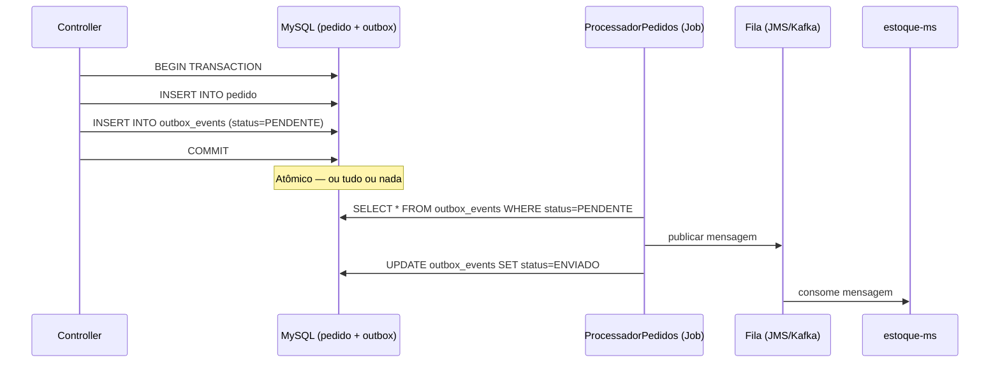

# Material de Suporte — Outbox Pattern, Controle de Jobs e Logging

**Objetivo:** Entender e implementar três conceitos fundamentais para microsserviços em produção: o **Outbox Pattern** para entrega confiável de mensagens, ferramentas de **controle de jobs** para processamento agendado, e **logging estruturado** para observabilidade.

> **Contexto no projeto:** O `vendas-ms` já possui a estrutura inicial de mensageria (`PedidoProducer`, `PedidoMessageOutput`, `ProcessadorPedidos`). Neste material você vai entender *por que* esse código existe e como ele resolve problemas reais de microsserviços.

---

## Parte 1 — Outbox Pattern

### O problema: o perigo do dual-write

Imagine o método `salvar()` do `PedidoController`: ele precisa fazer **duas coisas** ao mesmo tempo — persistir o pedido no banco de dados e publicar uma mensagem na fila para que outros serviços (estoque, notificações, financeiro) sejam notificados.

```java
// CÓDIGO PERIGOSO — duas operações não atômicas
public void criarPedido(Pedido pedido) {
    pedidoRepository.save(pedido);         // (1) salva no banco
    pedidoProducer.publicar(pedido);       // (2) publica na fila
}
```

**O que pode dar errado?**

| Cenário | Resultado |
|---|---|
| (1) ok, (2) falha (fila fora do ar) | Pedido salvo, mas nenhum serviço é notificado. Estoque nunca é atualizado. |
| (1) falha, (2) ok | Mensagem publicada para um pedido que não existe no banco. |
| Crash entre (1) e (2) | Estado inconsistente permanente. |

Este é o problema do **dual-write**: duas operações em sistemas diferentes sem garantia atômica. É um dos problemas mais difíceis em arquiteturas distribuídas.

---

### A solução: Transactional Outbox Pattern

O **Outbox Pattern** resolve o dual-write transformando o problema de "dois sistemas" em "um sistema": em vez de publicar diretamente na fila, a mensagem é gravada em uma tabela `outbox` dentro da **mesma transação** do banco de dados. Um processo separado lê a tabela e publica as mensagens.



**Por que isso funciona?** O banco de dados garante que o `INSERT` no pedido e o `INSERT` no outbox acontecem ou os dois ou nenhum — é uma transação ACID. A publicação na fila passa a ser uma operação separada e **retentável**: se a fila estiver fora do ar, o job tenta de novo na próxima execução sem perder o evento.

---

### 1.1 Tabela Outbox

**Arquivo:** `src/main/resources/db/migration/V4__create_outbox_events.sql` *(criar)*

```sql
CREATE TABLE pedido_outbox (
                               id         CHAR(36)     NOT NULL PRIMARY KEY,
                               reference_id  CHAR(36)     NOT NULL,
                               class TEXT NOT NULL,
                               destination TEXT NOT NULL,
                               payload    TEXT         NOT NULL,
                               status     VARCHAR(20)  NOT NULL DEFAULT 'PENDENTE',
                               criado_em  DATETIME     NOT NULL DEFAULT CURRENT_TIMESTAMP,
                               enviado_em DATETIME
);
```

| Coluna         | Propósito                                  |
|----------------|--------------------------------------------|
| `id`           | Identificador único do evento (UUID)       |
| `reference_id` | Referência ao pedido que gerou o evento    |
| `type`         | Referência a classe `PEDIDO`               |
| `destination`  | Referência a fila `pedido.queue`           |
| `payload`      | Conteúdo serializado da mensagem (JSON)    |
| `status`       | `PENDENTE` → `ENVIADO` → (opcional) `ERRO` |
| `criado_em`    | Quando o evento foi gerado                 |
| `enviado_em`   | Quando foi publicado com sucesso           |

---

### 1.2 Entidade `OutboxEvent`

**Arquivo:** `src/main/java/br/com/fiap/vendasms/entities/OutboxEvent.java` *(criar)*

```java
@Entity
public class OutboxEvent {

    @Id
    @GeneratedValue(strategy = GenerationType.UUID)
    private UUID id;

    @Column(name = "reference_id", nullable = false)
    private String referenceId;      // ID do pedido que originou o evento

    @Column(name = "class", nullable = false, columnDefinition = "TEXT")
    private String type;             // ex: "PEDIDO" — identifica o tipo do agregado

    @Column(nullable = false, columnDefinition = "TEXT")
    private String destination;      // ex: "pedido.queue" — fila de destino

    @Column(nullable = false, columnDefinition = "TEXT")
    private String payload;          // conteúdo JSON da mensagem

    @Column(nullable = false)
    @Enumerated(EnumType.STRING)
    private Status status;

    @Column(name = "criado_em", nullable = false)
    private LocalDateTime criadoEm;

    @Column(name = "enviado_em")
    private LocalDateTime enviadoEm;

    public OutboxEvent() {
    }

    public OutboxEvent(String referenceId, String type, String destination, String payload) {
        this.referenceId = referenceId;
        this.type = type;
        this.destination = destination;
        this.payload = payload;
        this.criadoEm = LocalDateTime.now();
        this.status = Status.PENDENTE;
    }

    public void marcarComoEnviado() {
        this.status = Status.ENVIADO;
        this.enviadoEm = LocalDateTime.now();
    }

    public String getDestination() {
        return destination;
    }

    public String getPayload() {
        return payload;
    }

    public UUID getId() {
        return id;
    }


    public enum Status {
        PENDENTE,
        ENVIADO
    }
}
```

---

### 1.3 Repositório `OutboxEventRepository`

**Arquivo:** `src/main/java/br/com/fiap/vendasms/repositories/OutboxEventRepository.java` *(criar)*

```java
public interface OutboxEventRepository extends JpaRepository<OutboxEvent, String> {
    @Query(nativeQuery = true, value = "select distinct o.* from outbox_event o where o.status = 'PENDENTE' LIMIT 10 ")
    List<OutboxEvent> findDistinctPendentes();
}
```

---

### 1.4 Gravando no Outbox durante a transação

**Arquivo:** `src/main/java/br/com/fiap/vendasms/service/PedidoServiceImpl.java` *(modificar)*

```java
@Service
class PedidoServiceImpl implements PedidoService {

    private final PedidoRepository repository;

    private final OutboxEventRepository outboxEventRepository;

    private final CepApi cepApi;

    private final ObjectMapper mapper;

    private static String PEDIDO = "PEDIDO";

    private static String QUEUE = "pedido.queue";

    public PedidoServiceImpl(PedidoRepository repository, OutboxEventRepository outboxEventRepository, CepApi cepApi, ObjectMapper mapper) {
        this.repository = repository;
        this.outboxEventRepository = outboxEventRepository;
        this.cepApi = cepApi;
        this.mapper = mapper;
    }

    @Override
    public List<Pedido> findByClienteCpf(String cpf) {
        return this.repository.findByCliente_Cpf(cpf);
    }

    @Override
    @Transactional
    public void save(Pedido pedido)  {
        final Pedido saved = this.repository.save(pedido);
        final CepDetails cepDetails = cepApi.get(pedido.getCliente().getCep());
        try {
            final String message = mapPedidoMessage(pedido, cepDetails);
            this.outboxEventRepository.save(new OutboxEvent(saved.getId().toString(), PEDIDO,QUEUE, message));
        } catch (JsonProcessingException e) {
            throw new RuntimeException(e);
        }
    }

    @Override
    public List<Pedido> findDistinctByStatus(Pedido.Status status, Pageable pageable) {
        return this.repository.findDistinctByStatus(status, pageable);
    }

    private String mapPedidoMessage(Pedido p, CepDetails cepDetails) throws JsonProcessingException {
        PedidoMessageOutput message = new PedidoMessageOutput(p.getId(),
                new ClienteOutput(p.getCliente().getNome(), p.getCliente().getCep(), p.getCliente().getNumero(), cepDetails.logradouro(), cepDetails.bairro(),
                        cepDetails.localidade(), cepDetails.estado(), p.getCliente().getComplemento()));

        return this.mapper.writeValueAsString(message);
    }

}
```

**O que `@Transactional` garante aqui:** se `outboxRepository.save()` falhar (ex: violação de constraint), o `pedidoRepository.save()` é revertido automaticamente. Os dois ou vão juntos, ou nenhum vai.

**Por que `type` e `destination` no outbox?** Com esses dois campos a tabela se torna **genérica**: o mesmo mecanismo pode publicar eventos de `CLIENTE`, `PAGAMENTO`, etc., cada um para sua fila específica. O job lê o campo `destination` para saber para onde enviar — sem hardcode no código Java.

---

### 1.5 Comparação: com e sem Outbox

| | Sem Outbox | Com Outbox |
|---|---|---|
| **Atomicidade** | Nenhuma — dois sistemas independentes | Garantida pelo banco (ACID) |
| **Retentativa** | Manual e complexa | Automática — job re-processa PENDENTES |
| **Ordenação** | Não garantida | Garantida por `criado_em` |
| **Auditoria** | Zero | Histórico completo na tabela |
| **Complexidade** | Baixa | Média — exige tabela + job |

---

## Parte 2 — Controle de Jobs

### O que é um job?

Um **job** é uma tarefa executada de forma automática e agendada — sem intervenção do usuário. No contexto do `vendas-ms`, o `ProcessadorPedidos` é um job responsável por ler o outbox e publicar as mensagens na fila.

**Casos de uso comuns em microsserviços:**

- Processar fila de eventos pendentes (Outbox Pattern)
- Enviar e-mails ou notificações agendadas
- Gerar relatórios diários
- Limpar dados expirados (sessões, tokens, logs antigos)
- Sincronizar dados com sistemas externos

---

### 2.1 Spring `@Scheduled` — agendamento simples

O Spring oferece agendamento nativo via `@Scheduled`. Para habilitá-lo, adicione `@EnableScheduling` na classe principal:

**Arquivo:** `VendasMsApplication.java` *(modificar)*

```java
@SpringBootApplication
@EnableFeignClients
@EnableScheduling  // ← habilita o mecanismo de agendamento
public class VendasMsApplication {
    public static void main(String[] args) {
        SpringApplication.run(VendasMsApplication.class, args);
    }
}
```

**Arquivo:** `src/main/java/br/com/fiap/vendasms/jobs/ProcessadorPedidos.java` *(implementar)*

```java
@Component
public class OutBoxJob {

    private final OutBoxService outBoxService;
    private final JmsTemplate jmsTemplate;
    private final Logger logger = LoggerFactory.getLogger(OutBoxJob.class);

    public OutBoxJob(OutBoxService outBoxService, JmsTemplate jmsTemplate) {
        this.outBoxService = outBoxService;
        this.jmsTemplate = jmsTemplate;
    }

    @Scheduled(fixedRate = 10000)
    public void pedidosPendentes() {

        final List<OutboxEvent> pedentesToProcess = this.outBoxService.findPedentesToProcess();

        for (OutboxEvent outboxEvent : pedentesToProcess) {
            try {
                publish(outboxEvent);
                logger.info("Evento {} pendente processado com Sucesso",outboxEvent.getId());
            } catch (Exception e) {
                logger.error(e.getMessage());
            }
        }
    }

    @Transactional
    void publish(OutboxEvent outboxEvent) throws Exception {
        try {
            outboxEvent.marcarComoEnviado();
            this.outBoxService.save(outboxEvent);
            this.jmsTemplate.convertAndSend(outboxEvent.getDestination(), outboxEvent.getPayload());
        } catch (NestedRuntimeException e) {
            throw new Exception("Falha ao processar o pedido: " + outboxEvent.getId());
        }
    }
}
```

> **(1)** O `destination` vem do próprio registro do outbox — o job não precisa conhecer as filas de nenhum tipo de evento. Para publicar eventos de `CLIENTE` ou `PAGAMENTO` futuramente, basta gravar o `destination` correto no outbox e o mesmo job os processará.

---

### 2.2 Formas de agendar com `@Scheduled`

| Parâmetro | Comportamento | Exemplo |
|---|---|---|
| `fixedDelay` | Espera N ms **após o término** da execução anterior | `fixedDelay = 5000` (5s) |
| `fixedRate` | Inicia a cada N ms, independente de a anterior ter terminado | `fixedRate = 10000` (10s) |
| `cron` | Expressão cron — controle preciso de horário | `cron = "0 0 2 * * ?"` (todo dia às 2h) |
| `initialDelay` | Aguarda N ms antes da primeira execução | `initialDelay = 3000` |

**Expressão cron no Spring:** `segundos minutos horas dia-do-mês mês dia-da-semana`

```java
@Scheduled(cron = "0 */5 * * * ?")    // a cada 5 minutos
@Scheduled(cron = "0 0 8 * * MON-FRI") // 8h de segunda a sexta
@Scheduled(cron = "0 0 0 1 * ?")       // 1º dia de cada mês à meia-noite
```

---

### 2.3 Ferramentas além do Spring Scheduler

| Ferramenta | Quando usar | Características |
|---|---|---|
| **Spring `@Scheduled`** | Jobs simples, sem persistência de estado | Leve, zero configuração extra, não distribuído |
| **Quartz Scheduler** | Jobs persistentes, clusterizados, com histórico | Armazena execuções no banco, suporte a cluster |
| **Spring Batch** | Processamento em lotes de grandes volumes de dados | Conceito de Step/Job/Chunk, retry, skip, restart |
| **AWS EventBridge / Cloud Scheduler** | Jobs na nuvem, sem gerenciar infraestrutura | Triggers externos, integração com serviços AWS |

**Quando o `@Scheduled` simples não é suficiente:**

- O job precisa rodar em apenas **uma instância** quando a aplicação está em cluster (Quartz resolve com lock no banco)
- Você precisa de **histórico de execuções** e poder reprocessar jobs que falharam (Spring Batch)
- O job processa **milhões de registros** em lotes com paralelismo (Spring Batch com particionamento)

---

### 2.4 Problema em ambientes clusterizados

Com `@Scheduled` simples, se você subir **duas instâncias** do `vendas-ms`, **ambas** vão executar o job ao mesmo tempo, lendo os mesmos registros PENDENTE e publicando duplicatas.

**Solução 1 — Lock pessimista no banco:**

```java
@Lock(LockModeType.PESSIMISTIC_WRITE)
@Query("SELECT o FROM OutboxEvent o WHERE o.status = :status")
List<OutboxEvent> findByStatusWithLock(@Param("status") String status);
```

**Solução 2 — ShedLock** (biblioteca para locks distribuídos de jobs):

```java
@Scheduled(cron = "*/5 * * * * *")
@SchedulerLock(name = "processadorPedidos", lockAtMostFor = "PT30S")
public void processar() { ... }
```

O **ShedLock** cria uma tabela `shedlock` no banco e garante que apenas uma instância execute o job por vez, usando um registro de lock com TTL.

---

## Parte 3 — Logging

### Por que logging é crítico em microsserviços?

Em um monólito, quando algo dá errado você abre o console e vê o erro. Em uma arquitetura com múltiplos serviços, containers e instâncias, uma requisição do usuário pode passar por 5 serviços diferentes. Sem logging estruturado, rastrear um problema se torna uma busca num labirinto.

**Os três pilares da observabilidade:**

| Pilar | O que é | Ferramenta comum |
|---|---|---|
| **Logs** | Registro de eventos discretos que aconteceram | Logback, ELK Stack |
| **Métricas** | Medidas numéricas ao longo do tempo (latência, erros/s) | Prometheus, Grafana |
| **Traces** | Rastreamento de uma requisição por múltiplos serviços | Zipkin, Jaeger |

O logging é o pilar mais acessível e o ponto de partida para qualquer investigação.

---

### 3.1 SLF4J + Logback — a dupla padrão do Java

O Spring Boot já inclui **SLF4J** (Simple Logging Facade for Java) e **Logback** sem nenhuma dependência adicional.

**SLF4J** é uma *fachada* — define a API de logging que seu código usa. **Logback** é a implementação por baixo — define onde e como as mensagens são gravadas.

```java
// Import correto — sempre a interface SLF4J, nunca a implementação
import org.slf4j.Logger;
import org.slf4j.LoggerFactory;

@Component
public class ProcessadorPedidos {

    // Convenção: logger estático, nome da própria classe
    private static final Logger log = LoggerFactory.getLogger(ProcessadorPedidos.class);

    public void processar() {
        log.debug("Iniciando processamento...");
        log.info("Processando {} evento(s)", pendentes.size());
        log.warn("Fila com latência alta: {}ms", latencia);
        log.error("Falha ao publicar evento {}: {}", id, e.getMessage());
    }
}
```

**Por que `{}` em vez de concatenação?**

```java
// RUIM — concatena a string mesmo que DEBUG esteja desligado
log.debug("Pedido: " + pedido.getId() + " status: " + pedido.getStatus());

// BOM — a string só é montada se DEBUG estiver ativo
log.debug("Pedido: {} status: {}", pedido.getId(), pedido.getStatus());
```

---

### 3.2 Níveis de log e quando usar cada um

| Nível | Quando usar | Visível em produção? |
|---|---|---|
| `TRACE` | Detalhes internos de execução, loops, estados intermediários | Não (muito verboso) |
| `DEBUG` | Informações úteis durante desenvolvimento e investigação | Raramente |
| `INFO` | Eventos de negócio relevantes: pedido criado, usuário logado | Sim |
| `WARN` | Situação inesperada mas recuperável: retry, fallback ativado | Sim |
| `ERROR` | Falha que precisa de atenção: exceção não tratada, dados corrompidos | Sim (alerta) |

**Regra prática:** em produção, o nível mínimo visível costuma ser `INFO`. `DEBUG` e `TRACE` são ligados temporariamente durante investigação de um problema específico.

```properties
# application.properties
logging.level.root=INFO
logging.level.br.com.fiap.vendasms=DEBUG       # mais detalhe no nosso pacote
logging.level.org.springframework.web=WARN     # menos ruído do framework
```

---

### 3.3 O que logar (e o que evitar)

**Logue:**
- Início e fim de operações críticas (salvar pedido, publicar mensagem)
- Quantidades processadas (`Processando 15 evento(s)`)
- Erros com contexto suficiente para investigação
- Decisões de negócio relevantes (pedido aprovado, pagamento recusado)

**Não logue:**
- Senhas, tokens, números de cartão de crédito — nunca
- Dados pessoais desnecessários (LGPD)
- Stack traces completas no nível INFO — use ERROR
- Tudo dentro de um loop que itera milhões de vezes — mata a performance

---

### 3.4 Logging estruturado (JSON)

Em ambientes com múltiplos serviços e containers, os logs são agregados em ferramentas como **ELK Stack** (Elasticsearch + Logstash + Kibana) ou **Datadog**. Essas ferramentas esperam logs em formato **JSON**, não texto livre.

Adicione a dependência em `pom.xml`:

```xml
<dependency>
    <groupId>net.logstash.logback</groupId>
    <artifactId>logstash-logback-encoder</artifactId>
    <version>7.4</version>
</dependency>
```

Crie `src/main/resources/logback-spring.xml`:

```xml
<configuration>
    <springProfile name="prod">
        <!-- Produção: JSON estruturado para agregadores de log -->
        <appender name="JSON" class="ch.qos.logback.core.ConsoleAppender">
            <encoder class="net.logstash.logback.encoder.LogstashEncoder"/>
        </appender>
        <root level="INFO">
            <appender-ref ref="JSON"/>
        </root>
    </springProfile>

    <springProfile name="!prod">
        <!-- Desenvolvimento: texto legível no console -->
        <appender name="CONSOLE" class="ch.qos.logback.core.ConsoleAppender">
            <encoder>
                <pattern>%d{HH:mm:ss} [%thread] %-5level %logger{36} - %msg%n</pattern>
            </encoder>
        </appender>
        <root level="DEBUG">
            <appender-ref ref="CONSOLE"/>
        </root>
    </springProfile>
</configuration>
```

**O que o JSON estruturado parece:**

```json
{
  "timestamp": "2026-03-26T14:32:01.123Z",
  "level": "INFO",
  "logger": "br.com.fiap.vendasms.jobs.ProcessadorPedidos",
  "message": "Processando 3 evento(s) pendente(s)",
  "thread": "scheduling-1",
  "service": "vendas-ms"
}
```

Com esse formato, você pode filtrar por `level`, agrupar por `service`, e pesquisar por qualquer campo no Kibana.

---

## Parte 4 — Controle de Idempotência

### Por que idempotência é inseparável do Outbox Pattern

Na seção 2.4 vimos que o Outbox Pattern garante entrega **at-least-once** (ao menos uma vez). Isso significa que, em certas condições de falha, o mesmo evento pode ser publicado mais de uma vez:

```
Job lê evento PENDENTE
Job publica na fila ✓
Job falha antes de fazer UPDATE status=ENVIADO ✗
Job reinicia → lê o mesmo evento PENDENTE novamente
Job publica na fila → DUPLICATA
```

Sem idempotência no consumidor, o pedido seria processado duas vezes — estoque decrementado duas vezes, e-mail enviado duas vezes, cobrança duplicada.

**Idempotência** é a propriedade de uma operação que pode ser executada múltiplas vezes com o **mesmo resultado** que uma única execução. É o par obrigatório da entrega at-least-once.

---

### O que é uma operação idempotente?

| Operação | Idempotente? | Por quê |
|---|---|---|
| `SELECT * FROM pedido WHERE id = ?` | Sim | Leitura não altera estado |
| `UPDATE pedido SET status='ENVIADO' WHERE id = ?` | Sim | O resultado final é sempre o mesmo |
| `INSERT INTO pedido VALUES (...)` | **Não** | Segunda execução viola a PK ou cria duplicata |
| `quantidade = quantidade - 1` | **Não** | Cada execução altera o valor |
| `DELETE FROM pedido WHERE id = ?` | Sim | Segunda execução não encontra nada, sem efeito |

A chave para tornar operações não-idempotentes em idempotentes é **detectar e ignorar duplicatas**.

---

### 4.1 Estratégia 1 — Tabela de eventos processados

A abordagem mais robusta: o consumidor mantém uma tabela com os IDs dos eventos já processados. Antes de processar, verifica se o ID já existe.

**Arquivo:** `src/main/resources/db/migration/V5__create_eventos_processados.sql` *(criar no consumidor)*

```sql
CREATE TABLE eventos_processados (
    evento_id   CHAR(36)  NOT NULL PRIMARY KEY,
    processado_em DATETIME NOT NULL DEFAULT CURRENT_TIMESTAMP
);
```

**No consumidor da mensagem:**

```java
@Service
public class PedidoConsumer {

    private final EventosProcessadosRepository eventosProcessados;
    private final EstoqueService estoqueService;

    @Transactional
    public void processar(String eventoId, PedidoMessageOutput mensagem) {
        // (1) Verifica se já foi processado
        if (eventosProcessados.existsById(eventoId)) {
            log.warn("Evento {} já processado. Ignorando duplicata.", eventoId);
            return;  // idempotente — sai sem fazer nada
        }

        // (2) Processa a mensagem de negócio
        estoqueService.decrementar(mensagem.itensDoPedido());

        // (3) Registra que foi processado — dentro da mesma transação
        eventosProcessados.save(new EventoProcessado(eventoId));

        log.info("Evento {} processado com sucesso.", eventoId);
    }
}
```

**Por que os passos (2) e (3) precisam estar na mesma transação?** Se o serviço cair entre processar e registrar, o evento seria reprocessado na próxima entrega. Com `@Transactional`, ou os dois commits acontecem juntos ou nenhum acontece.

---

### 4.2 Estratégia 2 — Chave de Idempotência (Idempotency Key)

Usada principalmente em APIs HTTP. O cliente envia um identificador único junto com a requisição. O servidor armazena esse identificador e, se receber a mesma requisição novamente, retorna o resultado anterior sem reprocessar.

**Exemplo: endpoint de criação de pedido com idempotência:**

```java
@PostMapping("/pedidos")
public ResponseEntity<PedidoDto> criar(
        @RequestHeader("Idempotency-Key") String idempotencyKey,
        @RequestBody PedidoInputDto input) {

    // Verifica se já existe resultado para essa chave
    return idempotencyStore.get(idempotencyKey)
            .map(ResponseEntity::ok)                          // retorna o resultado anterior
            .orElseGet(() -> {
                var pedido = pedidoService.save(input.toEntity());
                var dto    = PedidoDto.from(pedido);
                idempotencyStore.store(idempotencyKey, dto);  // armazena para futuras duplicatas
                return ResponseEntity.status(201).body(dto);
            });
}
```

**Casos de uso:**
- Pagamentos: o cliente pode reenviar a requisição se não receber resposta (timeout de rede), sem cobrar duas vezes
- Criação de recursos: botão "Confirmar pedido" clicado duas vezes rapidamente
- Integrações com webhooks: o provedor pode reenviar o mesmo webhook até receber confirmação (200 OK)

**Onde armazenar as chaves:**
- **Banco de dados:** simples, durável, mas adiciona latência
- **Redis:** rápido, com TTL automático — ideal para chaves de curta duração (ex: 24h)

---

### 4.3 Estratégia 3 — Upsert (INSERT OR UPDATE)

Para casos em que a operação é naturalmente idempotente se você usar `INSERT ... ON DUPLICATE KEY UPDATE` (MySQL):

```sql
-- Cria ou atualiza o status do pedido — seguro para executar N vezes
INSERT INTO pedido (id, status, descricao)
VALUES (:id, :status, :descricao)
ON DUPLICATE KEY UPDATE
    status   = VALUES(status),
    descricao = VALUES(descricao);
```

Em JPA, o equivalente é verificar se a entidade existe antes de salvar:

```java
@Transactional
public Pedido salvarIdempotente(String eventoId, Pedido pedido) {
    return pedidoRepository.findById(pedido.getId())
            .orElseGet(() -> pedidoRepository.save(pedido)); // só salva se não existir
}
```

---

### 4.4 Propagando o ID do evento pelo Outbox

Para que o consumidor possa verificar duplicatas, o `id` do evento no outbox precisa chegar junto com a mensagem. Atualize `PedidoMessageOutput` para incluir esse campo:

**Arquivo:** `src/main/java/br/com/fiap/vendasms/external_interface/jms/PedidoMessageOutput.java` *(modificar)*

```java
public record PedidoMessageOutput(
        String eventoId,    // ← ID do outbox — chave de idempotência para o consumidor
        String type,        // ← "PEDIDO" — permite ao consumidor rotear pelo tipo do evento
        UUID   pedidoId,
        String status,
        String descricao,
        String clienteCpf
) {
    // Chamado no PedidoServiceImpl antes de serializar para o outbox
    public static PedidoMessageOutput from(String eventoId, Pedido pedido) {
        return new PedidoMessageOutput(
                eventoId,                        // ID do outbox gerado antes da persistência
                "PEDIDO",
                pedido.getId(),
                pedido.getStatus().name(),
                pedido.getDescricao(),
                pedido.getCliente().getCpf()
        );
    }
}
```

O `eventoId` no payload é a **chave de idempotência distribuída**: o consumidor usa esse ID para verificar na tabela `eventos_processados` se já processou este evento.

> **Fluxo completo com idempotência:**
> `PedidoServiceImpl.save()` gera o `UUID` do outbox → passa para `PedidoMessageOutput.from(eventoId, pedido)` → serializa o JSON → grava no outbox com aquele mesmo `id`. O consumidor lê o `eventoId` do payload e consulta sua tabela antes de processar.

---

### 4.5 Comparação das estratégias

| Estratégia | Onde é implementada | Complexidade | Melhor para |
|---|---|---|---|
| Tabela de eventos processados | Consumidor da mensagem | Média | Mensageria (Kafka, JMS, RabbitMQ) |
| Chave de idempotência (header) | API HTTP | Baixa | APIs REST públicas, pagamentos |
| Upsert (ON DUPLICATE KEY) | Banco de dados | Baixa | Sincronização de dados, carga em lote |
| Verificação de estado | Lógica de negócio | Mínima | Fluxos com estados bem definidos (ex: enum Status) |

**Verificação de estado** é a estratégia mais simples e já existe implicitamente no `vendas-ms`:

```java
// Só cancela se o pedido estiver PENDENTE — natural e idempotente
if (pedido.getStatus() != Status.PENDENTE) {
    log.warn("Pedido {} não pode ser cancelado. Status atual: {}", id, pedido.getStatus());
    return;  // segunda chamada não tem efeito — idempotente
}
pedido.setStatus(Status.CANCELADO);
```

---

## Mapa de implementação

| Arquivo | Ação | O que faz |
|---|---|---|
| `db/migration/V4__create_pedido_outbox.sql` | **Criar** | Tabela de eventos pendentes para publicação |
| `entities/OutboxEvent.java` | **Criar** | Entidade mapeada para a tabela outbox |
| `repositories/OutboxEventRepository.java` | **Criar** | Repositório com `findByStatus` |
| `service/PedidoServiceImpl.java` | **Modificar** | Gravar no outbox dentro da mesma transação do `save()` |
| `jobs/ProcessadorPedidos.java` | **Implementar** | Job `@Scheduled` que lê PENDENTES e publica na fila |
| `VendasMsApplication.java` | **Modificar** | Adicionar `@EnableScheduling` |
| `external_interface/jms/PedidoMessageOutput.java` | **Modificar** | Incluir `eventoId` como chave de idempotência no payload |
| `db/migration/V5__create_eventos_processados.sql` | **Criar** (consumidor) | Tabela de IDs de eventos já processados |
| `resources/logback-spring.xml` | **Criar** | JSON em prod, texto legível em dev |
| `configs/LoggingFilter.java` | **Criar** | Adiciona `requestId` ao MDC para rastreamento |
| `pom.xml` | **Modificar** | Adicionar Actuator e logstash-logback-encoder |

---

## Checklist de aprendizado

**Outbox Pattern**
- [ ] Entendo o problema do dual-write e por que ele é perigoso em sistemas distribuídos
- [ ] Sei por que `@Transactional` com duas operações em sistemas diferentes **não** garante atomicidade
- [ ] Entendo como o Outbox Pattern resolve o problema usando uma única transação de banco
- [ ] Sei criar a tabela `pedido_outbox` e a entidade correspondente
- [ ] Entendo o fluxo: `save()` → grava no outbox → job lê → publica → marca como ENVIADO
- [ ] Sei o risco de duplicatas em ambientes clusterizados e como o lock pessimista resolve

**Controle de Jobs**
- [ ] Sei usar `@Scheduled` com `fixedDelay`, `fixedRate` e `cron`
- [ ] Entendo a diferença entre `fixedDelay` (após término) e `fixedRate` (intervalo fixo)
- [ ] Sei ler uma expressão cron básica
- [ ] Entendo quando o `@Scheduled` simples não é suficiente e quais alternativas existem
- [ ] Entendo o problema de jobs duplicados em cluster e como o ShedLock resolve

**Logging**
- [ ] Sei a diferença entre SLF4J (API) e Logback (implementação)
- [ ] Uso `{}` para interpolação de parâmetros em vez de concatenação de string
- [ ] Conheço os cinco níveis de log e quando usar cada um
- [ ] Sei configurar níveis diferentes por pacote no `application.properties`
- [ ] Entendo o que é logging estruturado (JSON) e por que ele é necessário em microsserviços
- [ ] Sei o que é MDC e como usar para rastrear uma requisição em todos os seus logs
- [ ] Sei adicionar o Spring Boot Actuator e entendo o que cada endpoint expõe
- [ ] Sei alterar o nível de log em runtime via `/actuator/loggers` sem reiniciar a aplicação

**Controle de Idempotência**
- [ ] Entendo por que at-least-once delivery exige consumidores idempotentes
- [ ] Sei identificar quais operações são naturalmente idempotentes e quais precisam de controle explícito
- [ ] Sei implementar a estratégia de tabela de eventos processados no consumidor
- [ ] Entendo por que o registro do evento processado precisa estar na mesma transação da lógica de negócio
- [ ] Sei o que é uma Idempotency Key e quando usá-la em APIs HTTP
- [ ] Entendo como propagar o `eventoId` do outbox pelo payload da mensagem para uso como chave de idempotência
- [ ] Conheço a diferença entre as estratégias: tabela de processados, chave de idempotência, upsert e verificação de estado
