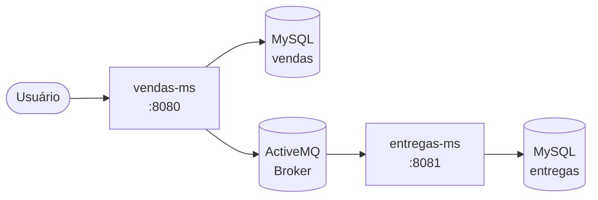
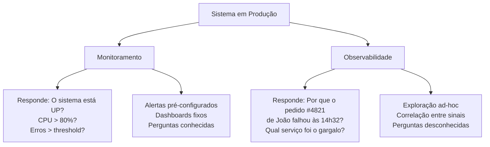
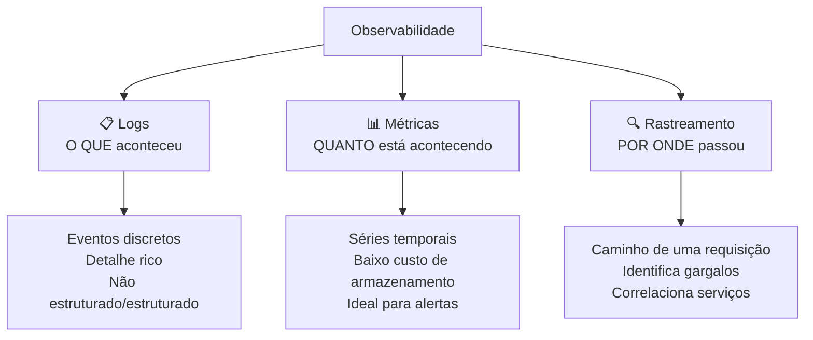
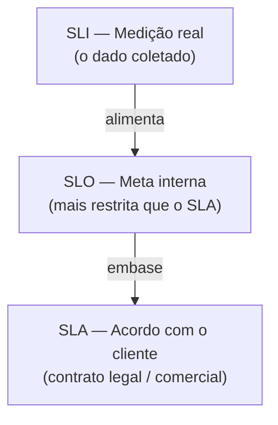
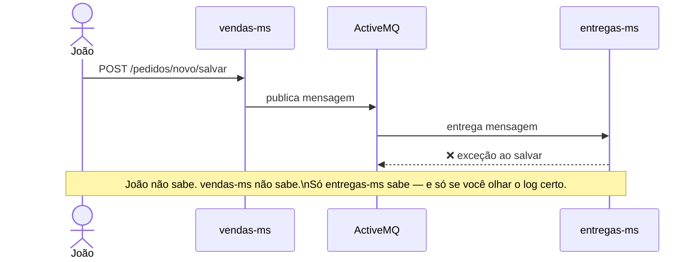
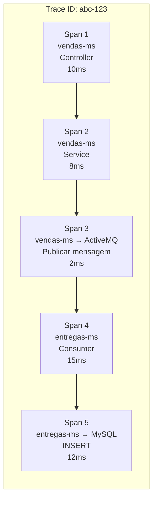
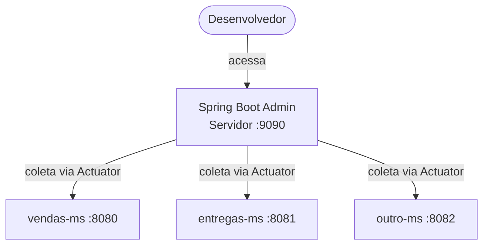
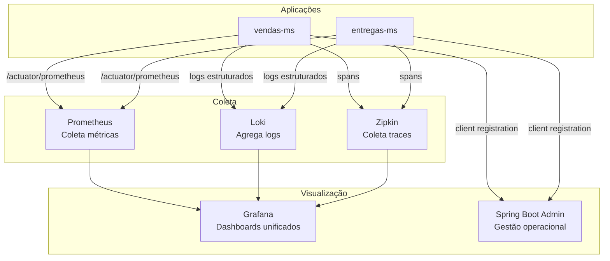

# Material de Suporte — Observabilidade em Microserviços

**Objetivo:** Entender o que é observabilidade, seus três pilares (logs, métricas e rastreamento), por que ela é indispensável em arquiteturas de microserviços, e como implementá-la no `vendas-ms` e no `entregas-ms` usando Spring Boot Actuator, Spring Boot Admin e ferramentas do ecossistema.

> **Nota:** Este material é conceitual e de configuração. Não é necessário implementar todos os itens em aula — o foco é que você consiga **enxergar o sistema por dentro** e saiba onde procurar quando algo der errado em produção.

---

## Por que observabilidade importa? — O incêndio silencioso

Imagine que você acorda às 3h da manhã com uma ligação:

> "O sistema de vendas está fora do ar. Clientes não conseguem fazer pedidos."

Você abre o terminal. Qual é a primeira pergunta que vem à cabeça?

**"O que está acontecendo lá dentro?"**

Se você não tem logs estruturados, métricas coletadas e rastreamento de requisições, você está tentando apagar um incêndio no escuro — sem saber onde o fogo começou, o que está queimando, e se já se espalhou.

**Observabilidade** é a capacidade de entender o estado interno de um sistema a partir de suas saídas externas. Não é só saber que algo falhou — é saber *exatamente onde*, *por quê* e *qual o impacto*.

---

## Parte 1 — O contexto: por que microserviços tornam tudo mais complexo

### 1.1 O monólito vs a cidade de microserviços

Em um monólito, você tem **um processo**. Se ele cai, você sabe. Se dá erro, há um único log para ler. A análise é linear.

Em uma arquitetura de microserviços como a do nosso projeto, a situação é radicalmente diferente:



Uma única ação do usuário — criar um pedido — pode tocar **5 componentes diferentes**. Se a entrega não foi registrada, o erro pode ter ocorrido em qualquer um deles.

| Cenário | Em um monólito | Em microserviços |
|---|---|---|
| Um componente falha | A aplicação cai, você sabe | Um serviço degrada silenciosamente |
| Rastrear um bug | Lê o log de um arquivo | Precisa correlacionar logs de N serviços |
| Medir performance | Um ponto de medição | Cada hop adiciona latência diferente |
| Deploy com bug | Um rollback | Qual serviço foi a origem do problema? |

> **Atenção:** Em microserviços, **falhas silenciosas são a norma, não a exceção**. Um serviço pode estar respondendo `200 OK` para o mundo externo enquanto internamente descarta dados ou degrada progressivamente. Sem observabilidade, você descobre quando o cliente reclama.

### 1.2 A analogia do avião

Um avião comercial moderno tem **milhares de sensores**. O piloto não abre a asa para verificar o motor — ele lê os instrumentos. Se a temperatura do motor 2 sobe 5°C além do normal, um alerta aparece antes de qualquer falha.

Seu sistema de software deveria funcionar da mesma forma. Cada componente deve emitir **sinais** — logs, métricas, traces — que permitem ao "piloto" (você, engenheiro de plantão) entender o estado do sistema sem precisar "abrir o capô" em produção.

---

## Parte 2 — Monitoramento vs Observabilidade

> **Por que X e não Y?** Muito material usa os dois termos como sinônimos. Eles não são.

### 2.1 A diferença fundamental

**Monitoramento** é a prática de coletar e visualizar métricas **predefinidas**. Você decide *antes* o que quer observar e configura alertas para isso.

**Observabilidade** é a propriedade de um sistema que permite que você faça **perguntas arbitrárias** sobre seu estado interno, incluindo perguntas que você não sabia que precisaria fazer quando o sistema foi construído.



| | **Monitoramento** | **Observabilidade** |
|---|---|---|
| **Foco** | Detectar falhas conhecidas | Entender falhas desconhecidas |
| **Pergunta** | "Está quebrado?" | "Por que quebrou? Onde? Para quem?" |
| **Abordagem** | Reativo (alerta dispara) | Exploratório (investigação ativa) |
| **Dado** | Métricas e alertas | Logs + Métricas + Traces correlacionados |
| **Analogia** | Termômetro de febre | Exame de sangue completo + raio-X |

> **Dica:** Monitoramento é **necessário** mas **não suficiente**. Todo sistema observável pode ser monitorado, mas nem todo sistema monitorado é observável. Monitoramento é um subconjunto de observabilidade.

---

## Parte 3 — Os três pilares da Observabilidade

A observabilidade é sustentada por três pilares complementares. Nenhum substitui o outro — eles se completam.



---

## Parte 4 — Logs

### 4.1 O que são logs

**Logs** são registros de eventos discretos que ocorreram no sistema em um determinado momento. São a forma mais antiga e intuitiva de observabilidade — mas também a mais fácil de fazer errado.

### 4.2 Níveis de log — o mapa de gravidade

O framework de log do Java (Logback / SLF4J) define 5 níveis, em ordem crescente de gravidade:

| Nível | Quando usar | Exemplo no `vendas-ms` |
|---|---|---|
| `TRACE` | Detalhes de execução interna, normalmente desligado em produção | Entrada e saída de cada método do serviço |
| `DEBUG` | Informações de depuração durante desenvolvimento | Valores dos parâmetros recebidos no controller |
| `INFO` | Eventos normais e esperados do negócio | "Pedido #123 criado para o cliente João" |
| `WARN` | Situação inesperada que não causou falha, mas deve ser investigada | "Tentativa de login com usuário não cadastrado" |
| `ERROR` | Falha que impediu uma operação de ser concluída | "Falha ao salvar pedido: banco de dados indisponível" |

> **Atenção:** Em produção, configure o nível mínimo como `INFO`. Deixar `DEBUG` ligado em produção pode expor dados sensíveis e gerar volume de log que torna impossível encontrar o que importa.

### 4.3 Boas práticas de log

#### ✅ CORRETO — Log estruturado com contexto

```java
// Em PedidoService.java
private static final Logger log = LoggerFactory.getLogger(PedidoService.class);

public Pedido salvar(Pedido pedido, String loginUsuario) {
    log.info("Iniciando criação de pedido. cliente={}, itens={}, usuario={}",
        pedido.getCliente().getId(),
        pedido.getItens().size(),
        loginUsuario); // (1) Contexto suficiente para investigar sem abrir o banco

    Pedido salvo = repository.save(pedido);

    log.info("Pedido criado com sucesso. pedidoId={}, clienteId={}, total={}",
        salvo.getId(),
        salvo.getCliente().getId(),
        salvo.getTotal()); // (2) Log de confirmação com o ID gerado — essencial para rastrear

    return salvo;
}
```

#### ❌ ERRADO — Log sem contexto

```java
// Versão ruim — não diz QUEM, O QUÊ ou QUAL o resultado
public Pedido salvar(Pedido pedido, String loginUsuario) {
    log.info("Salvando pedido..."); // O que isso diz? Nada útil.

    Pedido salvo = repository.save(pedido);

    log.info("Pedido salvo!"); // Qual pedido? De qual cliente?

    return salvo;
}
```

#### ❌ ERRADO — Log com dados sensíveis

```java
// NUNCA faça isso — expõe dados do usuário em logs
log.info("Usuário autenticado: login={}, senha={}, token={}",
    usuario.getLogin(),
    usuario.getSenha(), // ❌ NUNCA logue senhas
    accessToken);       // ❌ NUNCA logue tokens de sessão
```

### 4.4 Boas práticas de log — resumo

| Prática | Correto | Errado |
|---|---|---|
| **Contexto** | Inclua IDs, usuário, valores relevantes | "Operação realizada com sucesso" |
| **Nível** | Use o nível certo para a gravidade | Logar tudo como `INFO` ou `ERROR` |
| **Dados sensíveis** | Nunca logue senhas, tokens, CPF | Log completo do objeto `Usuario` |
| **Exceções** | `log.error("msg", e)` — inclua a stack | `log.error(e.getMessage())` perde a stack |
| **Volume** | INFO e acima em produção | DEBUG ligado em produção |
| **Formato** | `chave=valor` — facilita busca | Frases em linguagem natural sem estrutura |

### 4.5 Log estruturado — o próximo nível

Em sistemas com múltiplos serviços, o log em texto puro é difícil de buscar. **Log estruturado** em JSON permite que ferramentas de agregação filtrem por campo:

```java
// application.properties — ativar log em JSON com Logback
logging.structured.format.console=json
```

Saída em produção (facilmente indexável pelo ELK Stack ou Loki):

```json
{
  "timestamp": "2026-04-09T14:32:01.123Z",
  "level": "INFO",
  "logger": "br.com.fiap.vendasms.service.PedidoService",
  "message": "Pedido criado com sucesso",
  "pedidoId": 4821,
  "clienteId": 17,
  "total": 349.90
}
```

> **Dica:** Com log em JSON, você consegue buscar todos os logs do `pedidoId=4821` em todos os serviços com uma única query — isso é investigação de incidente em segundos, não horas.

---

## Parte 5 — Métricas, SLI, SLO e SLA

### 5.1 O que são métricas

**Métricas** são medições numéricas coletadas ao longo do tempo. Enquanto logs descrevem *o que aconteceu*, métricas descrevem *quanto, com que frequência e quão rápido*.

### 5.2 Tipos de métricas

| Tipo | O que mede | Exemplo no `vendas-ms` |
|---|---|---|
| **Counter** | Valores que só crescem | Total de pedidos criados desde o início |
| **Gauge** | Valor atual (sobe e desce) | Pedidos em processamento agora |
| **Histogram** | Distribuição de valores | Latência das requisições por percentil |
| **Timer** | Duração de operações | Tempo médio para salvar um pedido |

### 5.3 KPIs de negócio no `vendas-ms`

**KPI (Key Performance Indicator)** é uma métrica vinculada a um objetivo de negócio. Não é só "CPU em 40%" — é "taxa de conversão de pedidos em 98%".

| KPI | Como medir | Por que importa |
|---|---|---|
| **Taxa de criação de pedidos** | Pedidos/minuto | Queda abrupta indica problema grave |
| **Taxa de erro HTTP** | Respostas 5xx / total | > 1% indica degradação do serviço |
| **Latência p99** | 99° percentil do tempo de resposta | O pior caso que a maioria dos usuários experimenta |
| **Mensagens na fila** | `pedido.queue` backlog | Crescimento indica `entregas-ms` com problema |
| **Tempo de processamento de entrega** | Da mensagem ao registro no banco | > 30s indica gargalo no consumer |

### 5.4 SLI, SLO e SLA — a hierarquia dos acordos de nível de serviço

Estes três conceitos definem formalmente o que "funcionando bem" significa para o seu serviço.



| Conceito | O que é | Exemplo prático |
|---|---|---|
| **SLI** *(Service Level Indicator)* | A métrica real medida | Taxa de sucesso das requisições: 99,7% |
| **SLO** *(Service Level Objective)* | A meta interna que você se compromete a atingir | Manter taxa de sucesso ≥ 99,5% |
| **SLA** *(Service Level Agreement)* | O contrato formal com penalidades | "Disponibilidade de 99% — senão crédito de 10%" |

**Exemplo concreto para o `vendas-ms`:**

```
SLI: Taxa de sucesso medida nas últimas 24h = 99,7%
SLO: Meta = ≥ 99,5% de sucesso (margem de segurança antes de violar o SLA)
SLA: Contrato diz ≥ 99,0% — abaixo disso há multa contratual
```

> **Por que X e não Y?** O SLO é intencionalmente mais restrito que o SLA. Se você gerenciar pela meta do SLA, qualquer desvio já viola o contrato. O SLO é o "colchão de segurança" que dá tempo para corrigir antes de violar o compromisso com o cliente.

### 5.5 Error Budget — o orçamento de erros

A diferença entre o SLO e 100% é o seu **error budget** (orçamento de erros).

```
SLO = 99,5% de disponibilidade em 30 dias
Error Budget = 0,5% de 30 dias = 0,5% × 43.200 min = 216 minutos de indisponibilidade permitida
```

Se o sistema ficou fora do ar 100 minutos este mês, você tem 116 minutos restantes no budget. Quando o budget acaba, nenhum novo deploy deve ser feito até o próximo ciclo — a prioridade vira confiabilidade, não features.

---

## Parte 6 — Rastreamento Distribuído (Tracing)

### 6.1 O problema que o tracing resolve

Logs dizem o que aconteceu em cada serviço. Métricas dizem o quanto está acontecendo. Mas nenhum dos dois responde:

> **"A requisição do usuário João que falhou às 14h32 — por qual serviço ela passou e onde travou?"**



Sem rastreamento, correlacionar essa falha exige saber *exatamente quando* ocorreu em cada serviço e cruzar manualmente os logs. Com rastreamento, você tem um único identificador — o **trace ID** — que percorre todos os serviços.

### 6.2 Conceitos fundamentais de tracing



| Conceito | O que é |
|---|---|
| **Trace** | Representa o caminho completo de uma requisição de ponta a ponta |
| **Span** | Uma unidade de trabalho dentro de um trace (uma chamada de método, uma query SQL) |
| **Trace ID** | Identificador único propagado entre todos os serviços para correlacionar os spans |
| **Parent Span** | O span que originou o span atual — define a hierarquia da árvore de chamadas |

### 6.3 Como o Trace ID se propaga

O Trace ID viaja nos **headers HTTP** entre serviços. O padrão moderno é o **W3C Trace Context**:

```
traceparent: 00-abc123def456-span789-01
              ^  ^            ^       ^
              |  trace ID     span ID flags
              version
```

Com Spring Boot 3 + Micrometer Tracing, essa propagação é **automática** — você não precisa passar o header manualmente.

```yaml
# application.properties — habilitar tracing com Zipkin
management.tracing.sampling.probability=1.0
management.zipkin.tracing.endpoint=http://localhost:9411/api/v2/spans
```

---

## Parte 7 — Spring Boot Actuator

> **Destaque:** O Spring Boot Actuator é o ponto de entrada da observabilidade no ecossistema Spring. É o componente que expõe, de forma padronizada, todas as informações internas da aplicação.

### 7.1 O que é o Actuator

O **Spring Boot Actuator** é um módulo do Spring Boot que expõe **endpoints HTTP** (e JMX) com informações sobre o estado interno da aplicação — saúde, métricas, configuração, beans registrados, ambiente, e muito mais.

É como instalar um painel de instrumentos no seu avião. A aplicação continua voando normalmente, mas agora você tem visibilidade de tudo que acontece dentro do motor.

### 7.2 Adicionando o Actuator ao `vendas-ms`

```xml
<!-- pom.xml -->
<dependency>
    <groupId>org.springframework.boot</groupId>
    <artifactId>spring-boot-starter-actuator</artifactId>
</dependency>

<!-- Para métricas compatíveis com Prometheus -->
<dependency>
    <groupId>io.micrometer</groupId>
    <artifactId>micrometer-registry-prometheus</artifactId>
</dependency>
```

```properties
# application.properties — configurando o Actuator

# (1) Expõe todos os endpoints via HTTP (em produção, exponha apenas o necessário)
management.endpoints.web.exposure.include=health,info,metrics,prometheus,env,loggers

# (2) Mostra detalhes de saúde — útil para diagnóstico (cuidado em produção pública)
management.endpoint.health.show-details=always

# (3) Habilita detalhes de componentes individuais (banco, broker, etc)
management.health.db.enabled=true
management.health.jms.enabled=true

# (4) Porta separada para o Actuator — não mistura com o tráfego da aplicação
management.server.port=8090
```

### 7.3 Principais endpoints do Actuator

| Endpoint | URL | O que retorna |
|---|---|---|
| `/actuator/health` | `GET :8090/actuator/health` | Status geral: UP/DOWN, banco, broker, disco |
| `/actuator/metrics` | `GET :8090/actuator/metrics` | Lista de métricas disponíveis |
| `/actuator/metrics/{nome}` | `GET :8090/actuator/metrics/http.server.requests` | Valor de uma métrica específica |
| `/actuator/prometheus` | `GET :8090/actuator/prometheus` | Métricas no formato Prometheus |
| `/actuator/loggers` | `GET :8090/actuator/loggers` | Nível de log de cada pacote |
| `/actuator/env` | `GET :8090/actuator/env` | Variáveis de ambiente e propriedades |
| `/actuator/info` | `GET :8090/actuator/info` | Informações sobre a aplicação (versão, git commit) |
| `/actuator/threaddump` | `GET :8090/actuator/threaddump` | Dump das threads em execução |
| `/actuator/heapdump` | `GET :8090/actuator/heapdump` | Dump do heap JVM para análise offline |

### 7.4 Health Check — o coração do Actuator

O endpoint `/actuator/health` agrega o estado de todos os componentes críticos:

```json
{
  "status": "UP",
  "components": {
    "db": {
      "status": "UP",
      "details": { "database": "MySQL", "validationQuery": "isValid()" }
    },
    "jms": {
      "status": "UP",
      "details": { "provider": "ActiveMQ Classic" }
    },
    "diskSpace": {
      "status": "UP",
      "details": { "total": 499963174912, "free": 412876312576, "threshold": 10485760 }
    }
  }
}
```

Se o banco de dados cair, o status muda para `DOWN` e qualquer orquestrador (Kubernetes, load balancer) para de enviar tráfego para essa instância automaticamente.

### 7.5 Mudando o nível de log em tempo real

Um recurso poderoso e frequentemente ignorado: é possível mudar o nível de log de qualquer pacote **sem reiniciar a aplicação**:

```bash
# Ver o nível atual do pacote de pedidos
curl http://localhost:8090/actuator/loggers/br.com.fiap.vendasms.service

# Resposta:
# {"configuredLevel": "INFO", "effectiveLevel": "INFO"}

# Mudar para DEBUG em produção para investigar um problema
curl -X POST http://localhost:8090/actuator/loggers/br.com.fiap.vendasms.service \
     -H 'Content-Type: application/json' \
     -d '{"configuredLevel": "DEBUG"}'

# (Após investigar, volta para INFO sem reiniciar)
curl -X POST http://localhost:8090/actuator/loggers/br.com.fiap.vendasms.service \
     -H 'Content-Type: application/json' \
     -d '{"configuredLevel": "INFO"}'
```

> **Dica:** Esse recurso é ouro em incidentes de produção. Você ativa DEBUG no serviço específico, captura os logs detalhados do problema, e volta para INFO — tudo sem downtime.

### 7.6 Criando métricas customizadas com Micrometer

O Actuator usa o **Micrometer** como abstração de métricas. Você pode criar métricas de negócio diretamente no código:

```java
// PedidoService.java — métricas de negócio customizadas
@Service
public class PedidoService {

    private final PedidoRepository repository;
    private final Counter pedidosCriados;       // (1) Contador de pedidos criados
    private final Counter pedidosFalhos;         // (2) Contador de falhas
    private final Timer tempoSalvamento;         // (3) Tempo de salvar um pedido

    public PedidoService(PedidoRepository repository, MeterRegistry registry) {
        this.repository = repository;
        // (4) Registra as métricas com tags para filtrar depois
        this.pedidosCriados = Counter.builder("vendas.pedidos.criados")
            .description("Total de pedidos criados com sucesso")
            .register(registry);
        this.pedidosFalhos = Counter.builder("vendas.pedidos.falhos")
            .description("Total de pedidos que falharam ao ser criados")
            .register(registry);
        this.tempoSalvamento = Timer.builder("vendas.pedidos.tempo_salvamento")
            .description("Tempo para persistir um pedido no banco")
            .register(registry);
    }

    public Pedido salvar(Pedido pedido, String loginUsuario) {
        return tempoSalvamento.record(() -> { // (5) Cronometra automaticamente
            try {
                Pedido salvo = repository.save(pedido);
                pedidosCriados.increment();
                log.info("Pedido criado. pedidoId={}", salvo.getId());
                return salvo;
            } catch (Exception e) {
                pedidosFalhos.increment();
                log.error("Falha ao criar pedido. clienteId={}", pedido.getCliente().getId(), e);
                throw e;
            }
        });
    }
}
```

---

## Parte 8 — Spring Boot Admin

> **Destaque:** O Spring Boot Admin é uma interface gráfica centralizada para gerenciar múltiplos serviços que expõem o Actuator. É a diferença entre ler JSON bruto e ter um painel visual.

### 8.1 O que é o Spring Boot Admin

**Spring Boot Admin** é uma aplicação Spring Boot separada — um servidor de administração — que descobre e agrega as informações de Actuator de múltiplos serviços, apresentando tudo em uma interface web amigável.



### 8.2 Criando o servidor Spring Boot Admin

Crie um **novo projeto Spring Boot** apenas para o Admin (ou adicione em um módulo admin existente):

```xml
<!-- pom.xml do admin-server -->
<dependency>
    <groupId>de.codecentric</groupId>
    <artifactId>spring-boot-admin-starter-server</artifactId>
    <version>3.3.0</version>
</dependency>
<dependency>
    <groupId>org.springframework.boot</groupId>
    <artifactId>spring-boot-starter-web</artifactId>
</dependency>
```

```java
// AdminServerApplication.java
@SpringBootApplication
@EnableAdminServer // (1) Ativa o servidor Admin
public class AdminServerApplication {
    public static void main(String[] args) {
        SpringApplication.run(AdminServerApplication.class, args);
    }
}
```

```properties
# application.properties do admin-server
server.port=9090
spring.application.name=admin-server
```

### 8.3 Registrando o `vendas-ms` no Admin

No `vendas-ms`, adicione o cliente Admin e configure-o para se registrar automaticamente:

```xml
<!-- pom.xml do vendas-ms -->
<dependency>
    <groupId>de.codecentric</groupId>
    <artifactId>spring-boot-admin-starter-client</artifactId>
    <version>3.3.0</version>
</dependency>
```

```properties
# application.properties do vendas-ms
spring.application.name=vendas-ms
spring.boot.admin.client.url=http://localhost:9090    # (1) Onde está o servidor Admin
spring.boot.admin.client.instance.service-url=http://localhost:8080  # (2) Como o Admin alcança este serviço
management.endpoints.web.exposure.include=*           # (3) Expõe tudo para o Admin ver
management.endpoint.health.show-details=always
```

### 8.4 O que o Spring Boot Admin oferece

| Funcionalidade | O que você vê |
|---|---|
| **Dashboard** | Lista de todos os serviços e status (UP/DOWN/OFFLINE) |
| **Health** | Detalhes de saúde de cada componente com visual colorido |
| **Métricas** | Gráficos em tempo real de memória, CPU, threads, latência |
| **Loggers** | Alterar nível de log via interface gráfica (sem `curl`) |
| **Environment** | Variáveis e properties de cada instância |
| **Threads** | Thread dump visual, identifica deadlocks |
| **HTTP Traces** | Últimas requisições recebidas com detalhes |
| **Notificações** | Alertas por email/Slack quando um serviço cai ou sobe |

> **Dica:** O Spring Boot Admin com notificações transforma o seu laptop em uma central de operações. Você recebe um email/Slack automaticamente quando o `entregas-ms` cai — sem precisar ficar olhando para um dashboard.

---

## Parte 9 — Ferramentas do Ecossistema

### 9.1 Stack de Observabilidade — visão completa



### 9.2 Ferramentas Open Source

| Ferramenta | Categoria | O que faz | Integração Spring |
|---|---|---|---|
| **Prometheus** | Métricas | Coleta e armazena métricas em série temporal. "Scrapa" o `/actuator/prometheus` a cada intervalo | `micrometer-registry-prometheus` |
| **Grafana** | Visualização | Dashboards sobre qualquer fonte de dados (Prometheus, Loki, Zipkin) | Configuração externa |
| **Loki** | Logs | Agregação e busca de logs (da Grafana Labs). Indexa por labels, não por conteúdo | `loki-logback-appender` |
| **Zipkin** | Tracing | Coleta e visualiza traces distribuídos. Interface web para buscar por trace ID | `micrometer-tracing-bridge-brave` |
| **Jaeger** | Tracing | Alternativa ao Zipkin, mais robusta para produção. Suporte a OpenTelemetry | `opentelemetry-sdk` |
| **OpenTelemetry** | Padrão | Padroniza a coleta de logs, métricas e traces — vendor-neutral | `opentelemetry-spring-boot-starter` |
| **ELK Stack** | Logs | Elasticsearch + Logstash + Kibana — busca full-text em logs | Logback Logstash encoder |

### 9.3 Ferramentas Comerciais

| Ferramenta | Categoria | Diferenciais | Custo |
|---|---|---|---|
| **Datadog** | Full-stack | APM, infraestrutura, logs, traces em uma plataforma. Fácil de usar, rápido de integrar | Por host/mês |
| **New Relic** | APM | Análise profunda de performance de código (method-level tracing) | Baseado em dados |
| **Dynatrace** | APM | Descoberta automática de topologia, IA para detecção de anomalias | Por host/mês |
| **Splunk** | Logs | Busca e correlação de logs em grande escala. Padrão em grandes enterprises | Por GB ingerido |
| **Honeycomb** | Observabilidade | Focado em "observabilidade de alta cardinalidade" — colunar, muito rápido para exploração | Por evento |
| **Elastic APM** | APM | Parte do Elastic Stack, boa integração com ELK existente | Open Source + Cloud |
| **AWS CloudWatch** | Full-stack | Nativo AWS — sem fricção se já está na AWS | Por métrica/log/trace |

### 9.4 Comparativo Open Source vs Comercial

| Critério | Open Source | Comercial |
|---|---|---|
| **Custo inicial** | Gratuito | Pode ser alto |
| **Custo operacional** | Alto (você gerencia a infra) | Baixo (gerenciado) |
| **Tempo de setup** | Horas/dias | Minutos |
| **Escalabilidade** | Você é responsável | Automática |
| **Integração** | Manual | SDKs prontos |
| **Suporte** | Comunidade | SLA com o vendor |
| **Ideal para** | Aprendizado, startups, empresas com equipe DevOps forte | Empresas que precisam de produtividade rápida |

> **Por que X e não Y?** Não existe resposta errada. Muitas empresas usam **Grafana + Prometheus + Loki** open source para métricas e logs, e uma ferramenta comercial de APM para tracing — combinando o melhor dos dois mundos.

---

## Parte 10 — Estudo de Caso: Investigando um Incidente Real

### 10.1 Cenário

É segunda-feira às 9h. O suporte recebe reclamações: "Clientes estão conseguindo criar pedidos, mas as entregas não aparecem no `entregas-ms`."

### 10.2 Sem observabilidade — o pesadelo

```
09:00 — Suporte recebe reclamação
09:15 — Você descobre o problema
09:20 — Conecta no servidor de produção via SSH
09:30 — Começa a ler o log manualmente (tail -f com grep)
09:45 — Percebe que o log do entregas-ms foi rotacionado — dados perdidos
10:00 — Reinicia o entregas-ms "para ver se resolve"
10:15 — Ainda acontece
10:30 — Pede ajuda para o DBA ver o banco
11:00 — Descobre que a fila do ActiveMQ está com 3.000 mensagens acumuladas
11:30 — Entende que o entregas-ms estava caindo por falta de memória
Total: 2h30 de downtime de entrega, múltiplos clientes impactados
```

### 10.3 Com observabilidade — a investigação eficiente

```
09:00 — Suporte recebe reclamação
09:02 — Você abre o Grafana. Dashboard de Saúde mostra:
         - vendas-ms: UP ✓
         - entregas-ms: UP ✓
         - ActiveMQ pedido.queue: 3.247 mensagens ⚠️ (normal: < 10)

09:04 — Métrica "vendas.pedidos.criados" mostra ritmo normal
         Métrica "entregas.entregas.criadas" zerou há 1h40 ⚠️

09:06 — Abre logs do entregas-ms no Loki, filtra por level=ERROR no período
         Log: "OutOfMemoryError: Java heap space" — 97 ocorrências desde 07h20

09:08 — Abre Spring Boot Admin, acessa entregas-ms > Métricas > JVM Memory
         Gráfico mostra heap crescendo linearmente até 512MB (limite) e caindo — memory leak

09:10 — Abre o Zipkin, busca traces com status ERROR do entregas-ms
         Identifica que o span "salvar entrega no banco" tem um campo `imagemEntrega` retornando 8MB por registro

09:15 — Encontra a causa raiz: uma migração de banco adicionou uma coluna de imagem
         sendo carregada desnecessariamente no consumer
09:20 — Correção aplicada (lazy loading na coluna blob)
09:25 — Deploy do entregas-ms, fila começa a drenar
09:40 — 3.247 entregas processadas, sistema normal
Total: 40 minutos, causa raiz identificada, sem reinicializações às cegas
```

### 10.4 Lições do estudo de caso

| Sinal | Ferramenta | O que revelou |
|---|---|---|
| Fila crescendo | Prometheus + Grafana | Havia um gargalo no consumer |
| Métrica zerou | Grafana | Entregas pararam de ser criadas |
| `OutOfMemoryError` | Loki (log) | Causa da instabilidade |
| Heap crescendo | Spring Boot Admin / JVM Metrics | Memory leak em progresso |
| Span pesado no banco | Zipkin | Campo blob sendo carregado indevidamente |

---

## Parte 11 — Docker Compose: levantando a stack de observabilidade

```yaml
# docker-compose-observabilidade.yml
version: '3.8'

services:
  # Coleta e armazena métricas
  prometheus:
    image: prom/prometheus:latest
    ports:
      - "9090:9090"
    volumes:
      - ./prometheus.yml:/etc/prometheus/prometheus.yml
    networks:
      - obs-network

  # Dashboards unificados
  grafana:
    image: grafana/grafana:latest
    ports:
      - "3000:3000"
    environment:
      - GF_SECURITY_ADMIN_PASSWORD=admin
    networks:
      - obs-network

  # Rastreamento distribuído
  zipkin:
    image: openzipkin/zipkin:latest
    ports:
      - "9411:9411"
    networks:
      - obs-network

  # Administração visual dos microserviços
  spring-admin:
    image: <sua-imagem-admin-server>
    ports:
      - "9000:9090"
    networks:
      - obs-network

networks:
  obs-network:
    driver: bridge
```

```yaml
# prometheus.yml — diz ao Prometheus onde coletar métricas
global:
  scrape_interval: 15s   # Coleta a cada 15 segundos

scrape_configs:
  - job_name: 'vendas-ms'
    static_configs:
      - targets: ['host.docker.internal:8090']   # porta do Actuator
    metrics_path: '/actuator/prometheus'

  - job_name: 'entregas-ms'
    static_configs:
      - targets: ['host.docker.internal:8091']
    metrics_path: '/actuator/prometheus'
```

---

## Parte 12 — Mapa de Implementação

### Para o `vendas-ms`

| Arquivo | Ação | O que faz |
|---|---|---|
| `pom.xml` | **Modificar** | Adicionar `spring-boot-starter-actuator`, `micrometer-registry-prometheus`, `spring-boot-admin-starter-client` |
| `application.properties` | **Modificar** | Configurar endpoints do Actuator, porta de management, registro no Admin |
| `service/PedidoService.java` | **Modificar** | Adicionar logs estruturados e métricas customizadas com Micrometer |
| `docker-compose-observabilidade.yml` | **Criar** | Levantar Prometheus, Grafana, Zipkin e Spring Boot Admin |
| `prometheus.yml` | **Criar** | Configurar scrape do `vendas-ms` e `entregas-ms` |

### Para o `entregas-ms`

| Arquivo | Ação | O que faz |
|---|---|---|
| `pom.xml` | **Modificar** | Mesmas dependências do `vendas-ms` |
| `application.properties` | **Modificar** | Porta de management diferente (8091), registro no Admin |
| `service/EntregaService.java` | **Modificar** | Logs e métricas no consumer de mensagens |

### Servidor Admin (novo projeto)

| Arquivo | Ação | O que faz |
|---|---|---|
| `pom.xml` | **Criar** | Projeto Spring Boot com `spring-boot-admin-starter-server` |
| `AdminServerApplication.java` | **Criar** | Classe principal com `@EnableAdminServer` |
| `application.properties` | **Criar** | Porta 9090, nome `admin-server` |

---

## Checklist de aprendizado

- [ ] Sei explicar a diferença entre **monitoramento** e **observabilidade** com um exemplo concreto
- [ ] Entendo os três pilares: **logs**, **métricas** e **rastreamento**, e quando cada um é mais útil
- [ ] Sei distinguir **SLI**, **SLO** e **SLA** e construir um exemplo para o `vendas-ms`
- [ ] Entendo o conceito de **error budget** e por que ele governa decisões de deploy
- [ ] Sei adicionar o **Spring Boot Actuator** ao `vendas-ms` e configurar os endpoints expostos
- [ ] Consigo usar o endpoint `/actuator/health` para verificar o estado do banco e do broker
- [ ] Sei mudar o nível de log em tempo real via Actuator **sem reiniciar** a aplicação
- [ ] Consigo criar **métricas customizadas** com `Counter` e `Timer` usando Micrometer
- [ ] Sei configurar o **Spring Boot Admin** (servidor e cliente) e registrar o `vendas-ms`
- [ ] Entendo o que é um **Trace ID** e como ele correlaciona spans entre `vendas-ms` e `entregas-ms`
- [ ] Sei diferenciar as ferramentas do ecossistema: **Prometheus** (coleta), **Grafana** (visualização), **Zipkin** (tracing), **Loki** (logs)
- [ ] Entendo por que **observabilidade é crítica em microserviços** e consigo articular isso com o estudo de caso do incidente
- [ ] Sei escrever um **log estruturado** com contexto adequado (IDs, usuário, valores) sem expor dados sensíveis
