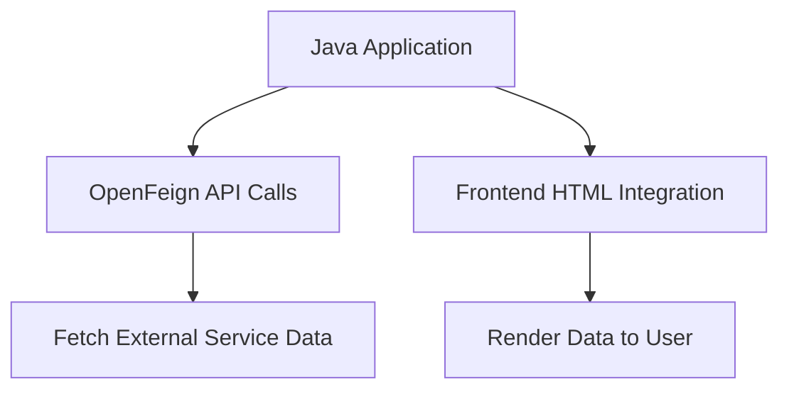
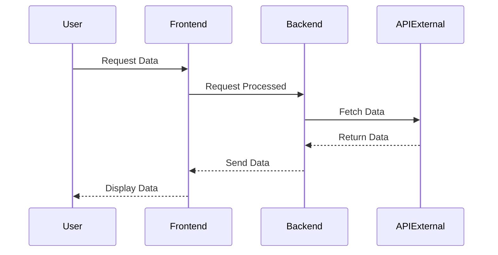

# Java Advanced: Notas da Aulas 20/02/2026

---

- **Tema Principal:** Integração de Backend Java com APIs Externas
- **Subtítulo:** Desenvolvimento de um Sistema de Vendas
- **Data:** 20/02/2026
- **Professor:** Tiago Ferrer

---

## Visão Geral da Aula

Nesta aula, exploramos a integração de uma aplicação Java com um serviço externo usando Spring Cloud e OpenFeign. Focamos no desenvolvimento de uma aplicação de vendas, abordando aspectos de ligação de frontend HTML com um backend Java. Exploramos a forma de construir projetos reutilizando componentes e criando uma estrutura modular e escalável.

### Objetivo da Aula

- Demonstrar como integrar uma aplicação Java com serviços externos.
- Enfatizar a importância de estruturas modularizadas e reutilizáveis.
- Ensinar o uso de OpenFeign para facilitar chamadas a APIs externas.

### Problema Central Abordado

Como conectar uma aplicação Java a APIs externas e vincular conexões frontend e backend de maneira eficiente?

### Principais conceitos trabalhados

- Uso do OpenFeign do Spring Cloud para chamadas de API.
- Estruturação e modulação de projetos Java.
- Integração de templates HTML com backend Java usando Thymeleaf.
- Melhorias na experiência do usuário com manipulação de dados via interface.

---

## Mapa Conceitual



---

## Desenvolvimento Estruturado

### 1. Conceito X: OpenFeign

#### 1.1 Definição

OpenFeign é uma ferramenta de cliente HTTP para Java que permite a comunicação com APIs externas de forma declarativa, minimizando a quantidade de código necessário para realizar chamadas de rede.

#### 1.2 Características

- Simplicidade na definição de chamadas de API através de interfaces Java.
- Integração facilitada com o Spring Cloud.
- Eliminação da necessidade de escrever código repetitivo para chamadas HTTP.

#### 1.3 Exemplos

Definição de uma interface para consumir uma API de CEP:
```java
@FeignClient(name = "cepApi", url = "https://viacep.com.br/ws")
public interface CepApi {
    @GetMapping("/{cep}/json")
    CepDetails getCepDetails(@PathVariable("cep") String cep);
}
```

#### 1.4 Armadilhas Comuns

- Dependência de serviços externos pode levar a falhas se não manejadas corretamente (ex.: APIs fora do ar).
- Testes de integração são necessários para garantir que a comunicação entre os serviços seja correta.

### Explicações Aprofundadas

Ao lidar com APIs externas, o OpenFeign permite que desenvolvedores Java definam chamadas de API como métodos de uma interface, traduzindo essas definições diretamente em chamadas HTTP.

### Comparações com Conceitos Similares

| Conceito       | Definição | Vantagens                          | Limitações                                    | 
| -------------- | --------- | ---------------------------------- | --------------------------------------------- |
| OpenFeign      | Cliente HTTP para APIs | Simplicidade e integração com Spring | Requer dependência do Spring Cloud            | 
| RestTemplate   | Cliente REST | Mais baixo nível, maior controle | Mais verboso, requer mais código               | 

### Fluxo das Chamadas de API



### Exemplos Práticos

#### Exemplo de Código

Implementação de uma chamada de API para consulta de CEP:
```java
@FeignClient(name = "cepApi", url = "https://viacep.com.br/ws")
public interface CepApi {
    @GetMapping("/{cep}/json")
    CepDetails getDetailsByCep(@PathVariable("cep") String cep);
}
```

#### Caso de Uso: Consulta de Endereço com CEP
- Usuário informa o CEP.
- Sistema busca informações no serviço de CEP.
- Dados são renderizados e exibidos no frontend.

---

## Perguntas Potenciais de Prova

### Discursivas
1. Explique o princípio de funcionamento do OpenFeign.
2. Como o Thymeleaf contribui para a integração frontend-backend em projetos Java?
3. Discuta as vantagens e desvantagens de usar o OpenFeign em aplicações distribuídas.
4. Quais são as alternativas ao Thymeleaf em projetos Spring e quais seriam suas vantagens?
5. Descreva o fluxo de uma aplicação Spring interagindo com uma API externa via OpenFeign.

### Objetivas
1. O que o OpenFeign facilita em um projeto Java?
   - a) Gerenciamento de sessão
   - b) Fazer chamadas de API
   - c) Armazenar dados no banco de dados
   - d) Implementar autenticação

2. Qual anotação é usada para declarar um cliente OpenFeign?
   - a) @FeignController
   - b) @FeignClient
   - c) @FeignAPI
   - d) @ClientFeign

3. Qual dessas opções não é uma vantagem do OpenFeign?
   - a) Simplicidade na configuração
   - b) Uso de interfaces Java
   - c) Complexidade elevada de leitura
   - d) Integração com Spring Cloud

4. O que é necessário para Thymeleaf renderizar uma página HTML?
   - a) Modelo de dados backend
   - b) Modelo MVC completo
   - c) Configuração de temas CSS
   - d) Script de inicialização Python

5. Qual dos métodos não é um método HTTP?
   - a) GET
   - b) POST
   - c) LINK 
   - d) DELETE

### Reflexão Crítica

1. Como a modularidade em frameworks como Spring contribui para a escalabilidade de aplicações corporativas?
2. Em que medida a dependência de serviços externos pode afetar a segurança de uma aplicação?

---

## Resumo Final Estruturado

- **Conceitos-chave:** OpenFeign, Thymeleaf.
- **Principais Aprendizados:** Integração de APIs externas, simplicidade na comunicação de serviços, renderização de templates HTML.
- **Aplicações Práticas:** Consumo de serviços de CEP, apresentação de dados em tempo real, melhoria da experiência do usuário final.

---

## Glossário

- **OpenFeign:** Ferramenta de cliente HTTP para comunicação entre serviços em Java.
- **Thymeleaf:** Motor de template Java para renderizar HTML.
- **API:** Interface de Programação de Aplicação, conjunto de definições para integração de software.
- **Frontend/Backend:** Camadas de uma aplicação; frontend lida com a interface do usuário enquanto o backend trata o processamento de dados.
- **Spring Cloud:** Framework para aplicações de nuvem, simplificando a comunicação entre serviços.

```
