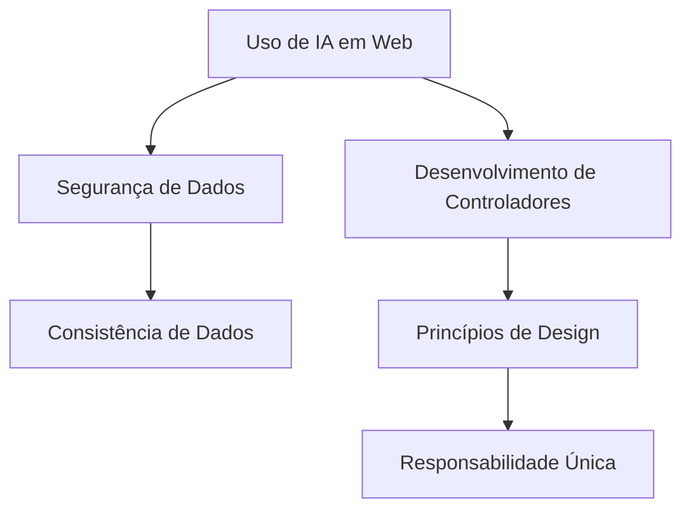

# Aula sobre Desenvolvimento de Aplicações Web

- **Tema Principal:** Integração de Tecnologias de IA em Aplicações Web
- **Subtítulo:** Uso de Inteligência Artificial no Desenvolvimento de Controladores e Interfaces
- **Data:** 26/02/2026
- **Professor:** Tiago Ferrer

## Visão Geral da Aula

### Resumo da Aula
A aula aborda a integração de controladoras e interfaces de usuário utilizando Spring Boot WebMVC além de abordar o uso de IA e tecnologias de nuvem para otimizar o desenvolvimento de aplicações web enquanto preservam a segurança e a consistência dos dados.

### Objetivo da Aula
Capacitar os alunos para realizar a ligação entre a controladora e templates hmtl utilizando Thymeleaf e ao uso adequado da IA.

### Principais Conceitos Trabalhados
- Uso de tecnologias de IA e nuvem em desenvolvimento web
- Segurança e consistência de dados
- Desenvolvimento de controladoras
- Implementação do Thymeleaf
- Princípios de design de software, como responsabilidade única

## Mapa Conceitual

## Desenvolvimento Estruturado

### 1. Uso de IA em Desenvolvimento de Aplicações Web

#### 1.1 Definição
Utilização de Inteligência Artificial para otimizar o desenvolvimento de aplicações, tanto em eficiência quanto em segurança.

#### 1.2 Características
- Integração de IA para análise automática de código e identificação de bugs.
- Uso de ferramentas de nuvem para melhorar a performance.

#### 1.3 Exemplos
- Utilização do Cloud para maior precisão na escrita de código.
- Automação no diagnóstico de problemas com IA.

#### 1.4 Armadilhas Comuns
- Dependência excessiva de IA sem compreensão do código gerado.
- Falta de validação manual, levando a potenciais vulnerabilidades.

### 2. Desenvolvimento de Controladoras

#### 2.1 Definição
Criação de partes do software que gerenciam a lógica de interação entre a interface do usuário e o banco de dados.

#### 2.2 Características
- Uso do Spring Boot para criar aplicações web robustas.
- Implementação de segurança e consistência.

#### 2.3 Exemplos
- Criação de controladores para gerir registros de clientes e pedidos.
- Enriquecimento de dados em DTOs para manter a imutabilidade.

#### 2.4 Armadilhas Comuns
- Falta de implementação do princípio da Responsabilidade Única.
- Configuração inadequada de segurança, permitindo vazamento de dados.

## Tabelas Comparativas

| Conceito             | Definição                                                                                     | Vantagens                                          | Limitações                                     | Exemplo                                          |
|----------------------|-----------------------------------------------------------------------------------------------|----------------------------------------------------|-------------------------------------------------|--------------------------------------------------|
| Uso de IA            | Aplicação de algoritmos de IA para automação e otimização de tarefas                          | Aumento de eficiência e precisão                   | Dependência tecnológica                         | Uso de IA para diagnóstico de bugs               |
| Desenvolvimento Web  | Uso de frameworks para criar aplicações web robustas.                                         | Melhoria na estrutura e segurança do software       | Curva de aprendizado de frameworks              | Criação de Controladores em Spring Boot          |

### Exemplos Práticos

#### Exemplo 1: Diagnóstico de Bugs
1. Utilização de IA para identificar possíveis erros em controladores.
2. Análise dos resultados e solução dos bugs utilizando feedback do sistema.

#### Exemplo 2: Desenvolvimento de Controladoras
1. Criação de um controlador para gerenciar registros de clientes.
2. Implementação de segurança no acesso aos dados do cliente.

## Perguntas Potenciais de Prova

### Discursivas
1. Explique como a utilização de IA pode otimizar o desenvolvimento de software.
2. Qual a importância do princípio da Responsabilidade Única no design de software?
3. Descreva o processo de enriquecimento de um DTO e suas vantagens.
4. Analise as implicações de segurança de não validar adequadamente dados de entrada.
5. Explique o conceito de domínio rico e sua importância na manutenção de software.

### Objetivas
1. Qual ferramenta de Spring é usada para criar aplicações web robustas?
2. Como são chamados os construtores em Java que são posicionais?
3. Qual a importância de métodos imutáveis em Java?
4. Qual é o papel de um controlador no padrão MVC?
5. O que o termo 'redirect' implica em uma aplicação web?

### Reflexão Crítica
1. Como a evolução da IA mudará o papel do desenvolvedor de software nos próximos anos?
2. Debata a questão da segurança de dados em aplicações que integram IA e nuvem.

## Resumo Final Estruturado

- **IA e Desenvolvimento Web:** Integração para otimizar processos.
- **Segurança de Dados:** Importância de validações adequadas.
- **Princípios de Design:** Uso de práticas como Responsabilidade Única.
- **Spring Boot:** Ferramenta chave para criação de controladores.
- **Imutabilidade em Java:** Garantia de segurança em padrões de projeto.

## Glossário

- **DTO (Data Transfer Object):** Padrão de projeto para transferência de dados entre subsistemas.
- **Responsabilidade Única:** Princípio de design que sugere que uma classe deve ter apenas uma razão para mudar.
- **Imutabilidade:** Propriedade de um objeto cujo estado não pode ser modificado após a criação.
- **Redirect:** Comando para redirecionar uma requisição para uma nova URL.