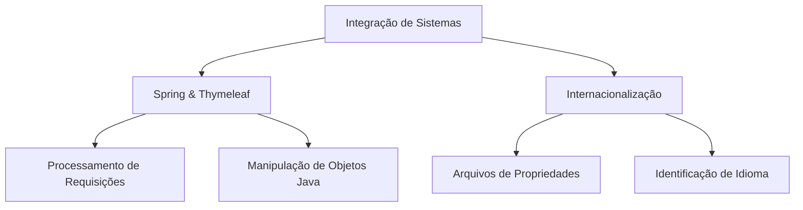

# Aula sobre Integração de Sistemas com Internacionalização

- **Tema Principal:** Integração de Sistemas Web com Foco em Internacionalização
- **Subtítulo:** Práticas com Thymeleaf e Controle de Requisições HTTP
- **Data:** 27/02/2026
- **Professor:** Tiago Ferrer

---

## 2. Visão Geral da Aula

### Resumo Estruturado
Nesta aula, exploramos a integração de sistemas web utilizando Spring e Thymeleaf, focando no processamento de requisições, manipulação de objetos Java e a implementação de internacionalização. O conteúdo abordou desde a manipulação de dados com entidades Java até a configuração de um sistema multi-idioma através de arquivos de propriedades.

### Objetivo da Aula
- Demonstrar a integração entre tela e backend em aplicações Java.
- Enfatizar a importância da internacionalização em projetos web.
- Abordar técnicas para manipulação de dados e requisições HTTP.

### Problema Central Abordado
Implementação de funcionalidades de requisição e resposta em Java com a incorporação de internacionalização, incluindo debug e solução de erros comuns.

### Principais Conceitos Trabalhados
- Integração de Spring com Thymeleaf.
- Internacionalização (i18n) em aplicações web.
- Debugging de aplicações Java.
- Manipulação de objetos e DTOs para troca de dados.

---

## 3. Mapa Conceitual



---

## 4. Desenvolvimento Estruturado

### 1. Integração com Spring e Thymeleaf

#### 1.1 Definição
Integração que utiliza Spring para backend e Thymeleaf para renderização dinâmica de páginas web a partir de modelos de dados Java.

#### 1.2 Características
- Permite a manipulação direta de objetos Java nas views.
- Utiliza atributos de modelo para controlar o fluxo de informações.

#### 1.3 Exemplos
Exemplo típico seria a criação de páginas de pedido, onde dados de cliente e pedidos são preenchidos e processados em tempo real.

#### 1.4 Armadilhas Comuns
- Má configuração de mapeamentos de métodos HTTP pode causar erros de requisição.
- O uso incorreto de expressions no Thymeleaf pode resultar em renderização inadequada das páginas.

### 2. Internacionalização

#### 2.1 Definição
Capacidade de uma aplicação suportar múltiplos idiomas, adaptando seu conteúdo de acordo com a localização do usuário.

#### 2.2 Características
- Baseada em arquivos de propriedades que mapeiam chaves para traduções.
- Integração com o Thymeleaf permite modificar textos diretamente nas views.

#### 2.3 Exemplos
Configuração de `messages.properties` e `messages_en.properties` para suportar português e inglês, respectivamente.

#### 2.4 Armadilhas Comuns
- Falhas em mapeamentos de chaves podem resultar em strings não traduzidas.
- Verificações de idioma incorretas podem carregar o idioma padrão errado.

---

## 5. Tabelas Comparativas

| Conceito               | Definição                                                               | Vantagens                                               | Limitações             | Exemplo                                                       |
|------------------------|------------------------------------------------------------------------|---------------------------------------------------------|------------------------|---------------------------------------------------------------|
| **Spring & Thymeleaf** | Integração para renderização dinâmica de HTML com dados Java           | Renderização eficiente, integração direta com backend   | Requer boa configuração| Templates dinâmicos para formulários de pedidos               |
| **Internacionalização** | Suporte a múltiplos idiomas em aplicações                              | Experiência do usuário personalizada                    | Gestão complexa de recursos | Suporte para PT-BR e EN em uma aplicação de vendas e pedidos |

---

## 6. Fluxos, Processos ou Etapas

### Fluxo de Manipulação de Requisição:
1. **Recepção de Dados:** Via formulário Thymeleaf.
2. **Conversão:** Dados do formulário são convertidos para objeto Java.
3. **Processamento:** Lógica de negócio aplicada no backend.
4. **Resposta:** Dados processados retornam para o cliente (usuário final).

### Etapas para Implementação de Internacionalização:
1. **Criação de Arquivos de Propriedades:** Definir tradução por idioma.
2. **Configuração do Thymeleaf:** Ajustar model e view para suportar mudanças de idioma.
3. **Testes a/b de Idiomas:** Verificação de acordância com as preferências do usuário.

---

## 7. Exemplos Práticos

### 1. Uso de Thymeleaf para Renderização
```java
// Controller method mapping
@GetMapping("/pedido/novo")
public String novoPedido(Model model) {
    model.addAttribute("cliente", new ClienteDto());
    model.addAttribute("pedido", new PedidoInputDto());
    return "novoPedido";
}
```

### 2. Implementação de Internacionalização
Arquivo `messages.properties`:
```properties
titulo.bemVindo = Bem-vindo ao sistema de vendas
```

Arquivo `messages_en.properties`:
```properties
titulo.bemVindo = Welcome to the sales system
```
---

## 8. Perguntas Potenciais de Prova

### Perguntas Discursivas
1. Explique como funciona a integração entre Spring e Thymeleaf em um sistema web.
2. Descreva os passos necessários para implementar a internacionalização em uma aplicação Java.
3. Qual é a função dos arquivos `messages.properties` em uma aplicação internacionalizada?
4. Como você lidaria com um erro 500 resultante da falta de mapeamento correto de URLs em Spring?
5. Discuta a importância da utilização de DTOs (Data Transfer Objects) em aplicações Java.

### Perguntas Objetivas
1. O que caracteriza a renderização dinâmica no Thymeleaf?
   - ( ) Uso de expressões Java
   - (X) Uso de templates ligados ao modelo de dados
   - ( ) Emprego de CSS dinâmico

2. Qual o verbo HTTP é utilizado para recuperação de dados?
   - (X) GET
   - ( ) POST
   - ( ) PUT

3. Qual é a estrutura básica para definir uma chave de tradução nos arquivos de propriedades?
   - ( ) key.translation
   - (X) key=value
   - ( ) value:key

4. Como você define um construtor em um DTO Java?
   - ( ) Com funções privadas
   - (X) Usando classes de modelo simples
   - ( ) Usando interfaces

5. Por que é importante realizar testes de idioma em uma aplicação internacionalizada?
   - ( ) Para economia de recursos
   - (X) Para assegurar a experiência do usuário
   - ( ) Para conformidade com leis locais

### Perguntas de Reflexão Crítica
1. Quais são os desafios enfrentados ao implementar a internacionalização em aplicações legacy?
2. Como a escolha de métodos HTTP impacta a segurança e eficiência de uma aplicação web?

---

## 9. Resumo Final Estruturado

- Integração eficaz entre Spring e Thymeleaf é crucial para renderização dinâmica.
- Internacionalização permite uma melhor experiência global de usuário.
- Debugging é essencial para a identificação e correção de erros em tempo real.
- Uso de DTOs facilita a transferência de dados entre camadas de aplicação.

---

## 10. Glossário

- **DTO (Data Transfer Object):** Estruturas que carregam dados entre processos.
- **Internacionalização (i18n):** Processo de projeto de software que adapta aplicações para diferentes idiomas.
- **Thymeleaf:** Motor de templates Java para sistemas web.
- **Spring:** Framework Java que suporta o desenvolvimento de aplicações robustas.