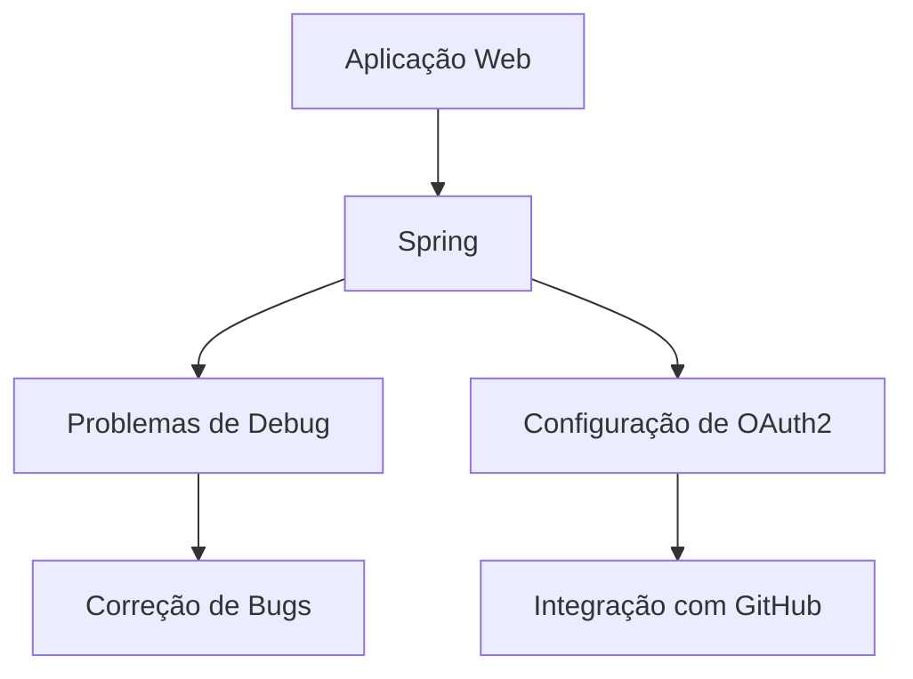

# Aula de Desenvolvimento de Aplicações Web

- **Tema Principal**: Debugging e Integração com OAuth2
- **Subtítulo**: Spring Security e Integração com GitHub
- **Data:** 05/03/2026
- **Professor:** Tiago Ferrer

## Visão Geral da Aula

### Resumo Estruturado
Nesta aula, abordamos técnicas de correção de bugs em aplicações web utilizando Java e frameworks como Spring, além da integração de segurança através do protocolo OAuth2 usando o GitHub como provedor. Os alunos foram expostos a processos práticos de debug e boas práticas de segurança.

### Objetivo da Aula
O objetivo principal foi elucidar o processo de correção de um bug específico no sistema e configurar a aplicação para autenticação segura utilizando OAuth2.

### Problema Central Abordado
Correção de erro na exibição de pedidos devido a problemas na integração entre o backend e o frontend, além de configurar uma autenticação segura usando OAuth2.

### Principais Conceitos Trabalhados
- Debugging de aplicações web
- Integração entre Spring e OAuth2
- Gerenciamento de dependências no Spring
- Estruturas de controle e segurança em aplicações web

## Mapa Conceitual

## Desenvolvimento Estruturado

### 1. Debugging de Aplicações Web

#### 1.1 Definição
Processo de identificação e correção de erros em um sistema de software.

#### 1.2 Características
- Envolve a análise minuciosa do código.
- Utiliza ferramentas específicas para identificar a origem do problema.
- Requer bom entendimento do fluxo da aplicação.

#### 1.3 Exemplos
Um exemplo prático discutido foi a falha na exibição de pedidos, onde o problema estava na maneira como os dados eram iterados e exibidos na interface HTML.

#### 1.4 Armadilhas Comuns
- Não verificar todas as camadas do sistema.
- Suposição de dados sem validação no console ou logs.

### 2. Integração com OAuth2

#### 2.1 Definição
OAuth2 é um protocolo de autenticação que permite que aplicações terceirizadas (clients) acessem recursos em nome do usuário final.

#### 2.2 Características
- Permite autenticação segura sem expor as credenciais do usuário.
- Usa tokens de acesso gerados por um servidor de autorização.

#### 2.3 Exemplos
Configuração do GitHub como servidor de autorização para a aplicação Spring, utilizando as bibliotecas do Spring Security.

#### 2.4 Armadilhas Comuns
- Vazamento de Client IDs e Secrets no repositório de código.
- Configurações incorretas de redirecionamento no aplicativo de terceiros.

## Tabelas Comparativas

| Conceito          | Definição                                                     | Vantagens                                    | Limitações                | Exemplo                           |
|-------------------|---------------------------------------------------------------|----------------------------------------------|---------------------------|-----------------------------------|
| Debugging         | Identificação e correção de erros em software                 | Permite localizar e corrigir erros           | Pode ser demorado         | Utilizando logs e breakpoints     |
| OAuth2            | Protocolo de autenticação                                     | Autenticação segura sem expor credenciais    | Configuração complexa     | Uso de login de terceiros (GitHub)|

## Fluxos, Processos ou Etapas

1. Identificação do problema através dos logs.
2. Análise do código e revisão da lógica de iteração dos pedidos.
3. Verificação das configurações de segurança e dependências.
4. Implementação do OAuth2 para autenticação utilizando GitHub.
5. Testes finais e validação de segurança.

## Exemplos Práticos

### Debugging
Após identificar o erro 500 na aplicação, foram utilizados logs e ferramentas de debugging para identificar que o problema estava na negação da condição de exibição dos pedidos.

### OAuth2 Integration
Configuração no GitHub Developer Settings para registrar a aplicação e obter um Client ID e Secret necessários para a integração com OAuth2.

## Perguntas Potenciais de Prova

### Dissertativas
1. Explique o processo de debugging utilizado na aula.
2. Descreva as vantagens do uso de OAuth2 em aplicações web.
3. Quais são as melhores práticas para evitar o vazamento de dados sensíveis no GitHub?
4. Como o Spring Security gerencia as autenticações OAuth2?
5. O que é o modelo de componente no Spring e qual sua importância?

### Objetivas
1. Qual a função do `@ModelAttribute` no Spring?
    - A) Manipular dados do frontend
    - B) Adicionar dependências
    - C) Pré-processar dados para a view
    - D) Gerenciar configurações de segurança

2. O que o método `isEmpty()` verifica?
    - A) Se uma variável é nula
    - B) Se uma string está vazia
    - C) Se uma lista não possui elementos
    - D) Todas as alternativas

### Reflexão Crítica
1. Quais são as implicações de segurança ao integrar aplicações com OAuth2?
2. Como o debug eficiente pode impactar na qualidade do software desenvolvido?

## Resumo Final Estruturado

- **Debugging**: Essencial para identificar e corrigir problemas.
- **OAuth2**: Protocolo de autenticação que aumenta a segurança.
- **Spring Security**: Facilita a implementação de segurança na aplicação.
- **Boas Práticas**: Evitar o vazamento de credenciais e usar debug de forma eficaz.

## Glossário

- **Debugging**: Processo de encontrar e resolver defeitos em um sistema.
- **OAuth2**: Protocolo de autenticação utilizado para proporcionar acesso seguro.
- **Spring**: Framework para desenvolvimento em Java.
- **Client ID**: Identificador utilizado em OAuth2 para identificar a aplicação cliente.
- **Token de Acesso**: Código que permite acesso a recursos de maneira segura.