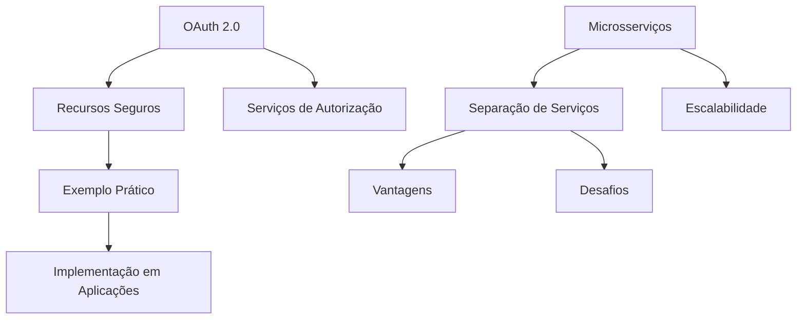
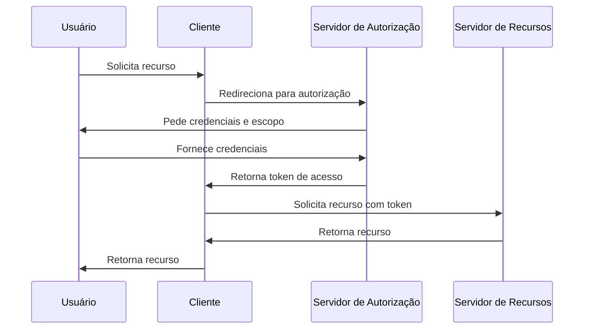

# Aula sobre OAuth 2.0 e Introdução a Microsserviços

**Tema Principal:** OAuth 2.0 e Microsserviços  
- **Data:** 06/03/2026
- **Professor:** Tiago Ferrer

## Visão Geral da Aula

### Resumo
Nesta aula, discutimos o funcionamento do OAuth 2.0 e suas aplicações práticas dentro de sistemas, especialmente em microsserviços. Primeiro, abordamos a estrutura e o fluxo do OAuth 2.0, que permite acesso seguro a recursos de diferentes servidores sem repassar credenciais como usuário e senha. Em seguida, introduzimos conceitos fundamentais de microsserviços, contrastando-os com arquiteturas monolíticas.

### Objetivo da Aula
Compreender o funcionamento e as vantagens do OAuth 2.0 em autenticação e autorização de recursos, e explorar a transição de sistemas monolíticos para arquiteturas baseadas em microsserviços.

### Problema Central Abordado
Como compartilhar informações seguras entre distintas aplicações sem repassar credenciais diretas de usuários, e os desafios de operacionalizar sistemas grandes e complexos.

### Principais Conceitos Trabalhados
- OAuth 2.0: Funcionamento e fluxo de autorização
- Microsserviços: Estrutura, vantagens e desvantagens
- Arquitetura Monolítica vs Microsserviços

## Mapa Conceitual

## Desenvolvimento Estruturado

### 1. OAuth 2.0

#### 1.1 Definição
OAuth 2.0 é um protocolo de autorização que permite que aplicativos de terceiros acessem recursos de um servidor em nome de um usuário, sem compartilhar sua senha.

#### 1.2 Características
- Não necessita de compartilhamento de credenciais
- Funciona através de tokens de acesso
- Incrementa a segurança na troca de dados entre aplicações

#### 1.3 Exemplos
- Login com redes sociais (ex: GitHub, Google)
- Integração de serviços (ex: acesso ao Google Drive a partir de outra aplicação)

#### 1.4 Armadilhas Comuns
- Configuração incorreta do escopo de autorização
- Não tratamento do processo de renovação de tokens
- Adequada proteção e manuseio dos tokens

### 2. Microsserviços

#### 2.1 Definição
Arquitetura de software onde aplicações são divididas em pequenos serviços independentes, cada um executando seu próprio processo e comunicando-se com mecanismos leves.

#### 2.2 Características
- Estão organizados em torno de capacidades de negócios
- Podem ser implementados e escalados independentemente
- Composição por pequenos serviços modulares

#### 2.3 Exemplos
- Amazon, Netflix, Mercado Livre (utilizam microsserviços para escalabilidade e manutenção de sistemas)

#### 2.4 Armadilhas Comuns
- Complexidade na gestão de comunicação entre serviços
- Desafios na manutenção de transações e consistência de dados
- Necessidade de sofisticada infraestrutura de monitoramento

## Tabelas Comparativas

| Conceito         | Definição                                                                 | Vantagens                                                     | Limitações                                                   | Exemplo                           |
|------------------|---------------------------------------------------------------------------|---------------------------------------------------------------|--------------------------------------------------------------|-----------------------------------|
| OAuth 2.0        | Protocolo de autorização que permite acesso a recursos sem senha          | Maior segurança, flexibilidade no acesso a múltiplos serviços | Requer configuração correta de escopos e gestão de tokens    | Login com Google                  |
| Microsserviços   | Estrutura de software dividida em pequenos serviços autônomos            | Escalabilidade, manutenção e desenvolvimento independentes    | Gestão complexa entre serviços e consistência de transações  | Arquitetura da Netflix            |
| Monolito         | Software estruturado como um bloco único                                  | Simplicidade inicial, tudo em um lugar                        | Dificuldade em escalar partes específicas                    | Aplicação tradicional de e-commerce |

## Fluxos, Processos ou Etapas

### Fluxo de Autorização OAuth 2.0

## Exemplos Práticos

### Exemplo Contextualizado
Implementação de uma aplicação utilizando OAuth 2.0 para autenticação e autorização ao acessar o recurso de repositórios públicos no GitHub. A aplicação solicita permissão ao usuário e, com o token obtido, recupera e lista os repositórios.

### Caso de Uso
Empresa de e-commerce usando microsserviços para gerir operações separadas de pedidos, estoque e entrega, cada qual em um serviço específico, melhorando a escalabilidade e o gerenciamento de recursos.

## Perguntas Potenciais de Prova

### Perguntas Discursivas
1. Explique o funcionamento do OAuth 2.0 e suas vantagens em sistemas distribuídos.
2. Quais são as principais diferenças entre uma arquitetura monolítica e de microsserviços?
3. Como o uso de microsserviços pode melhorar a escalabilidade de uma aplicação?
4. Discorra sobre as possíveis desvantagens na migração de um monólito para microsserviços.
5. Descreva um cenário em que o uso de OAuth 2.0 não seja recomendado.

### Perguntas Objetivas
1. O que é OAuth 2.0?
   - a) Sistema de armazenamento
   - b) Protocolo de autenticação
   - c) Protocolo de autorização
   - d) Estilo arquitetônico
2. Qual dos seguintes é um benefício dos microsserviços?
   - a) Aumento da complexidade
   - b) Escalabilidade independente
   - c) Comunicação direta entre serviços
   - d) Menor segurança no gerenciamento de dados
3. No OAuth 2.0, qual é o papel do cliente?
   - a) Providenciar tokens
   - b) Solicitar recursos em nome do usuário
   - c) Gerenciar a base de dados
   - d) Autenticar usuários
4. Qual das opções não é uma característica dos microsserviços?
   - a) Serviços altamente acoplados
   - b) Independência de implementação
   - c) Comunicação por APIs
   - d) Foco em pequenas funcionalidades de negócio
5. Em qual situação devemos considerar a arquitetura monolítica como benéfica?
   - a) Altamente distribuído
   - b) Múltiplos times de desenvolvimento
   - c) Aplicação inicial com recursos limitados
   - d) Necessidade de escalabilidade horizontal elevada

### Perguntas de Reflexão Crítica
1. Considerando os custos e vantagens, quando é apropriado para uma empresa migrar de uma aplicação monolítica para um sistema baseado em microsserviços?
2. Como as mudanças na regulamentação de privacidade em escala global podem influenciar o uso de protocolos como OAuth 2.0?

## Resumo Final Estruturado

- **OAuth 2.0: Protocolo** que permite acesso sem senha via tokens.
- **Microsserviços:** Estrutura dividida que melhora a escalabilidade.
- **Mas não descartam Monolitos:** Bons para sistemas iniciais com menor complexidade.
- **Boom de Demanda:** Microsserviços oferecem escalabilidade flexível.
- **Cuidado com Complexidade:** Comunicação e consistência são desafios.

## Glossário

- **OAuth 2.0:** Um protocolo de autorização padrão utilizado para fornecer acesso autorizado a recursos sem repassar credenciais sensíveis.
- **Microsserviços:** Metodologia de desenvolvimento que organiza uma aplicação como uma coleção de serviços pequenos e autônomos.
- **Token de Acesso:** Credencial utilizada em OAuth 2.0 para acessar recursos protegidos.
- **Monolitismo:** Arquitetura onde o software está conceituado como um bloco único, integrando todos os módulos funcionais da aplicação.
- **Escopo:** No contexto do OAuth, refere-se ao conjunto de permissões especificado por uma aplicação no momento da solicitação de autorização.