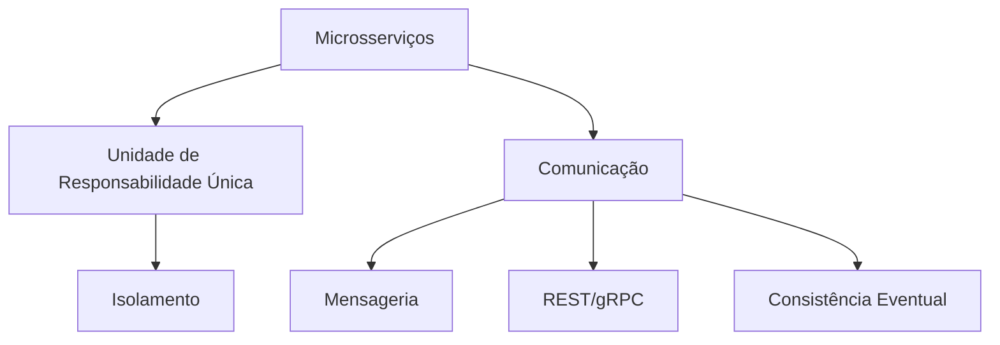

# Aula sobre Arquitetura de Microsserviços

- **Tema Principal:** Arquitetura de Microsserviços
- **Data:** 12/03/2026
- **Professor:** Tiago Ferrer

## Visão Geral da Aula

Nesta aula, foi discutido o conceito de microsserviços, suas vantagens, desvantagens e como eles se contrapõem às aplicações monolíticas. Foram abordadas as características dos microsserviços, quando utilizá-los, e as dificuldades que surgem ao optar por essa arquitetura. O objetivo é fornecer uma compreensão sólida sobre os tradeoffs na escolha entre microsserviços e monolitos, assegurando que decisões arquiteturais sejam baseadas em necessidades reais e não em modismos.

- **Objetivo da aula:** Entender a arquitetura de microsserviços, suas vantagens, limitações e quando aplicá-la.
- **Problema central abordado:** Quais são os critérios para seleção entre aplicação monolítica e microsserviços.
- **Principais conceitos trabalhados:** Monolitos, microsserviços, criticidade, consistência eventual, circuit breaker, containerização, e observabilidade.

## Mapa Conceitual

## Desenvolvimento Estruturado

### 1. Conceito de Microsserviços

#### 1.1 Definição
Microsserviços são uma abordagem arquitetural para desenvolver uma única aplicação como um conjunto de pequenos serviços, cada um executando seu próprio processo e comunicando-se através de mecanismos como API HTTP (REST) ou mensageria.

#### 1.2 Características

- **Isolamento:** Cada serviço está completamente isolado, contendo seu próprio banco de dados e lógica de aplicação.
- **Responsabilidade Única:** Cada microsserviço é responsável por uma única funcionalidade, ou um grupo coeso de funcionalidades.
- **Comunicação Leve:** Os serviços se comunicam geralmente via protocolos leves como HTTP/REST ou mensageria.

#### 1.3 Exemplos

- **E-commerce:** Um serviço separado para cada função, como gerenciamento de pedidos, autenticação, e inventário.
- **Sistemas Bancários:** Serviços distintos para transações, contas, e relatórios.

#### 1.4 Armadilhas Comuns

- **Complexidade Operacional:** A coordenação entre vários microsserviços pode ser complicada.
- **Consistência de Dados:** Manter consistência eventual pode ser desafiador.
- **Sobreposição de Funções:** Às vezes, os microsserviços podem acabar realizando funções que se sobrepõem.

### 2. Comparações com Monolitos

| Conceito | Arquitetura Monolítica | Arquitetura de Microsserviços |
|----------|------------------------|-------------------------------|
| **Definição** | Aplicação única e indivisível | Conjunto de serviços autônomos |
| **Vantagens** | Simplicidade de desenvolvimento e deploy | Escalabilidade e flexibilidade |
| **Desvantagens** | Dificuldade em escalar partes da aplicação separadamente | Complexidade operacional aumentada |

### 3. Exemplos Práticos

- **Caso do Mercado Livre vs Magazine Luiza:** O Mercado Livre, usa transações em tempo real para aprovar compras instantaneamente, enquanto a Magazine Luiza pode adotar uma abordagem de consistência eventual através de mensageria, aguardando um processamento assíncrono para validação de pagamentos.

### 4. Perguntas Potenciais de Prova

#### Discursivas

1. Explique a diferença entre consistência imediata e consistência eventual. Dê exemplos de situações em que cada um seria aplicável.
2. Quais são as vantagens e desvantagens da arquitetura de microsserviços comparada à monolítica?
3. Descreva como um Circuit Breaker pode melhorar a resiliência de um sistema de microsserviços.
4. Defina o conceito de criticidade entre serviços e sua importância na gestão de recursos de TI.
5. O que é containerização e como ela facilita o gerenciamento de microsserviços?

#### Objetivas

1. ( ) Microsserviços sempre devem compartilhar o mesmo banco de dados para garantir consistência.
2. ( ) A arquitetura de microsserviços elimina a necessidade de mecanismos de cache.
3. ( ) Consistência eventual é uma abordagem usada para sistemas que não requerem atualização em tempo real.
4. ( ) Em microsserviços, o Gateway atua como um ponto centralizado para comunicação interna.
5. ( ) A prática de observabilidade em microsserviços é opcional.

#### Reflexão Crítica

1. Em que tipos de organização a arquitetura de microsserviços poderia trazer mais desafios do que benefícios?
2. Quando poderia ser mais vantajoso adotar uma arquitetura monolítica, apesar do aumento da popularidade dos microsserviços?

## Resumo Final Estruturado

- **Microsserviços** são pequenos serviços independentes focados em uma funcionalidade específica.
- **Monolitos** são aplicações únicas que podem ser mais difíceis de escalar em partes específicas.
- Utilizar microsserviços envolve lidar com complexidade operacional e desafios de comunicação.
- **Containerização** ajuda no gerenciamento e isolamento de microsserviços.
- **Circuit Breaker** permite limitar os danos de falhas em serviços, assegurando resiliência.

## Glossário

- **DDD (Domain-Driven Design):** Metodologia de projeto de software centrada na modelagem do software baseada no domínio da aplicação.
- **Bounded Context:** Limitações contextuais que determinam uma fronteira entre diferentes domínios dentro de uma aplicação.
- **Circuit Breaker:** Padrão de design que visa proteger um sistema contra falhas, permitindo que ele reaja com graciosidade a falhas inesperadas.
- **Resiliência:** A capacidade de um sistema de se adaptar e se recuperar de mudanças ou falhas.
- **Containerização:** Técnica de virtualização a nível de sistema operacional usada para executar e isolar serviços em ambientes controlados.