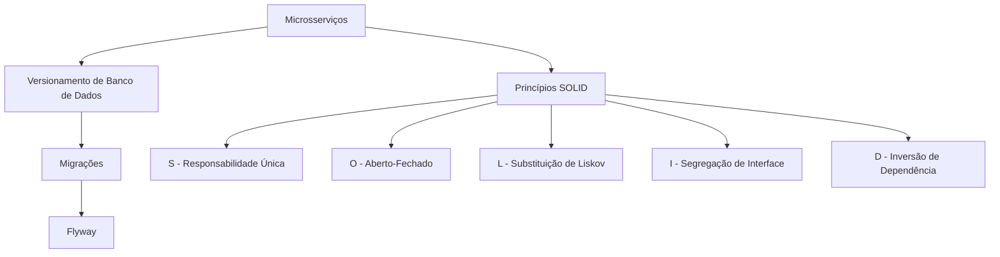

# Aula sobre Microsserviços, Versionamento de Bancos de Dados e Princípios SOLID

- **Data:** 14/03/2026
- **Professor:** Tiago Ferrer

## Visão Geral da Aula

Nesta aula, revisamos os conceitos e a teoria por trás da arquitetura de microsserviços, focando no entendimento crítico e não na aplicação de soluções absolutas. Discutimos o versionamento de bancos de dados usando migrações, destacando a importância de manter um histórico das mudanças para facilitar o desenvolvimento e testes. Exploramos ainda os princípios SOLID, fundamentais para o bom design de software orientado a objetos.

### Objetivo da Aula
- Desenvolver um entendimento profundo sobre a arquitetura de microsserviços.
- Compreender o conceito de migrações de banco de dados e sua execução prática.
- Estudar e refletir sobre os Princípios SOLID no design de software.

### Problema Central Abordado
- Como garantir a evolução e consistência de softwares complexos e seus bancos de dados ao longo do tempo?

### Principais Conceitos Trabalhados
- Arquitetura de microsserviços: crítica e prática.
- Migrações de banco de dados para versionamento dos esquemas.
- Princípios SOLID e seu impacto no design de software.

## Mapa Conceitual

## Desenvolvimento Estruturado

### 1. Microsserviços
#### 1.1 Definição
Arquiteturas de microsserviços são sistemas divididos em serviços menores e independentes que se comunicam entre si.

#### 1.2 Características
- Independência de desenvolvimento e deploy.
- Comunicação entre serviços geralmente via APIs REST.
- Flexibilidade e escalabilidade.

#### 1.3 Exemplos
- Uma aplicação composta por serviços individuais como autenticação, catálogo de produtos e carrinho de compras.

#### 1.4 Armadilhas Comuns
- Complexidade no gerenciamento e monitoramento.
- Desafios na comunicação síncrona entre serviços.

### 2. Versionamento de Banco de Dados
#### 2.1 Definição
Procedimento para rastrear e gerenciar mudanças no esquema do banco de dados ao longo do tempo usando migrações.

#### 2.2 Características
- Uso de ferramentas como Flyway para gerenciar scripts de alterações no banco de dados.
- Estrutura organizada de versões e descrições.

#### 2.3 Exemplos Aplicados
- Scripts SQL que criam e alteram tabelas de maneira incremental.

#### 2.4 Observações Importantes
- Mantenha versões consistentes para reproduzir estados de banco de dados em diferentes ambientes.

### 3. Princípios SOLID
#### 3.1 Conceito Geral
Conjunto de princípios para orientar o design de software orientado a objetos, visando melhora na manutenção e escalabilidade.

#### 3.2 Princípios Individuais
- **S: Responsabilidade Única**: Cada classe deve ter uma única responsabilidade.
- **O: Aberto/Fechado**: Classes devem estar abertas para extensão, mas fechadas para modificação.
- **L: Substituição de Liskov**: Objetos devem ser substituíveis por instâncias de seus subtipos sem alterar o comportamento desejado do programa.
- **I: Segregação de Interface**: Interfaces específicas são preferíveis a interfaces genéricas.
- **D: Inversão de Dependência**: Dependa de abstrações, não de implementações concretas.

## Perguntas Potenciais de Prova

### Perguntas Discursivas
1. Explique a importância do versionamento de bancos de dados em sistemas de microsserviços.
2. Descreva como os princípios SOLID contribuem para um design de software mais eficiente.
3. Discuta o conceito de migrações de banco de dados e sua importância.
4. Compare a arquitetura de microsserviços com a arquitetura monolítica.
5. Analise um cenário em que a substituição de Liskov poderia ser violada.

### Perguntas Objetivas
1. O que significa a sigla SOLID no contexto do design de software?
2. Qual é a função principal do Flyway em gestão de banco de dados?
3. Como o princípio de responsabilidade única pode evitar bugs?
4. O que é uma migração no contexto de bancos de dados?
5. Quais são as vantagens da arquitetura de microsserviços?

### Perguntas de Reflexão Crítica
1. Em que situações o uso dos princípios SOLID pode não ser vantajoso?
2. Reflita sobre as desvantagens da arquitetura de microsserviços em relação à manutenção.

## Resumo Final Estruturado

- **Microsserviços**: Flexibilidade e independência.
- **Versionamento de Banco**: Histórico e rastreabilidade via migrações.
- **Princípios SOLID**: Melhoram a manutenção e escalabilidade de software.

## Glossário

- **Microsserviços**: Estilo de arquitetura de software que estrutura uma aplicação como uma coleção de serviços.
- **Flyway**: Ferramenta para gerenciar mudanças em bancos de dados.
- **Migrations (Migrações)**: Padrão para gerenciar mudanças incrementais em bancos de dados.
- **SOLID**: Grupo de princípios de design de software.
- **Abstração**: Processo de ocultar os detalhes complexos de um sistema para expor funcionalidade mais significativa e útil para o usuário.